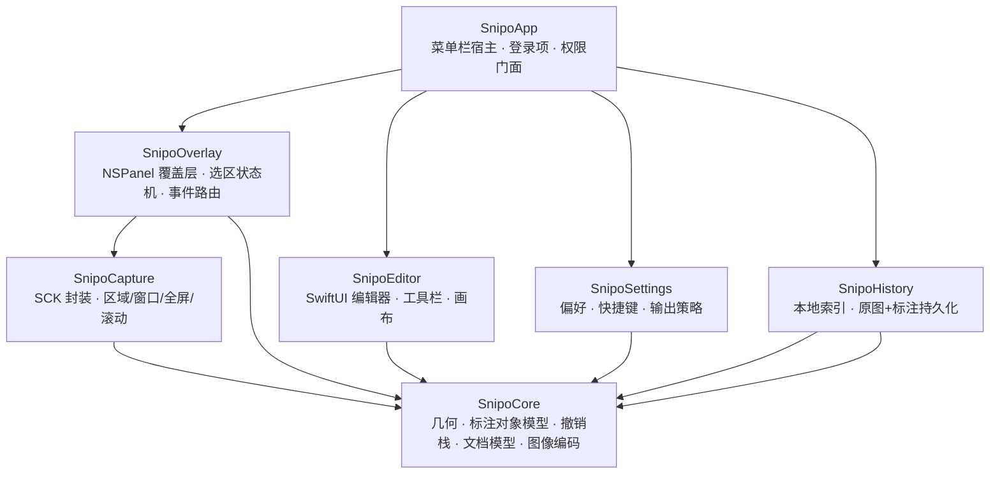
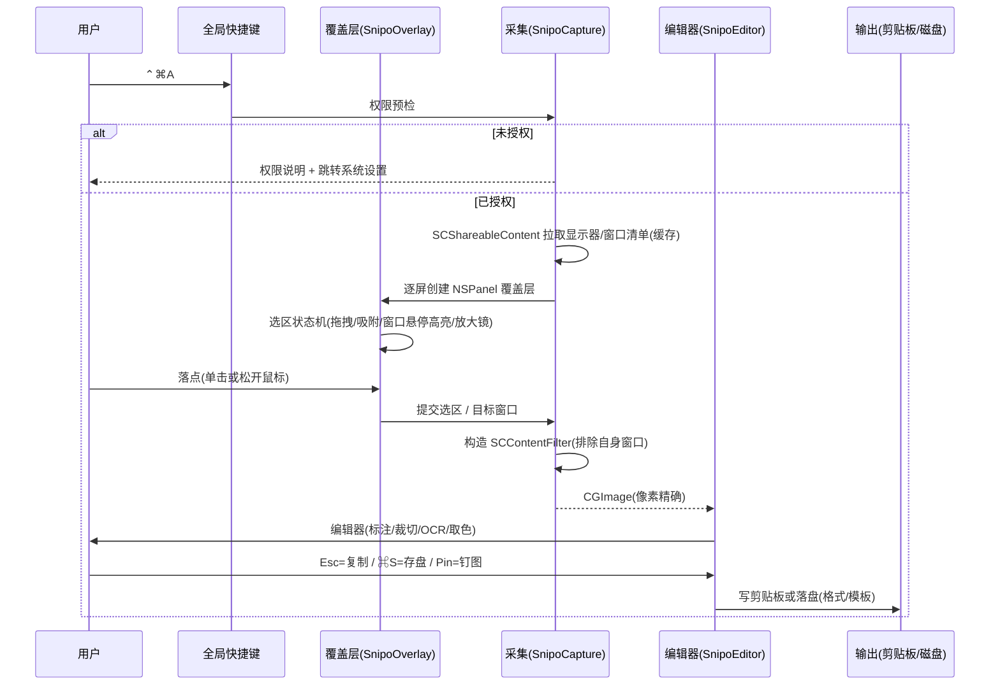
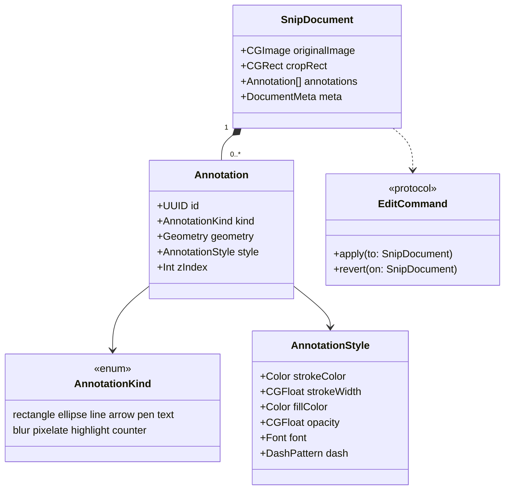

# Snipo — macOS 原生截屏工具 · 产品与方案设计

| 项 | 内容 |
| --- | --- |
| 文档版本 | v0.2（决策已确认） |
| 日期 | 2026-09-30 |
| 状态 | **Spec 已确认 · 待进入 solution 阶段（工程脚手架 + 测试计划）** |
| 目标平台 | macOS **15.0+**（本地开发环境：macOS 27.0 / Xcode 27.0 / Swift 6.4 / arm64） |
| 参考对象 | 腾讯 Snip（`snip.qq.com`，Mac App Store id 512505421） |
| 工作目录 | `/Users/tango/Developments/Marquee` |
| 关联文档 | `docs/RENDER-BENCH.md`（渲染技术实测报告）、`docs/SPIKE-PLAN.md`（坑点清单与提前验证报告） |

---

## 0. 决策摘要（TL;DR）

| # | 结论 | 状态 |
| --- | --- | --- |
| 1 | 旧版 Snip 的问题不是"功能不够"，而是 **2012 年的 Cocoa/Intel 架构未适配现代 macOS 的权限模型与硬件**，因此做**原生重写**，不做兼容层。 | ✅ |
| 2 | 重写必须保住旧版两个真正的差异化能力：**窗口自动识别高亮** 与 **滚动截屏**，这两个是能否替代旧版的关键。 | ✅ |
| 3 | 技术栈：**ScreenCaptureKit 采集 + AppKit 覆盖层 + SwiftUI 编辑器 + Swift 6 strict concurrency**，SPM 模块化，XcodeGen 产工程。 | ✅ |
| 4 | 明确砍掉旧版的腾讯生态能力（QQ 邮箱分享 / QQ 邮箱网页插件）——依赖腾讯账号体系，无法复刻也无价值。 | ✅ |
| 5 | 最低系统版本 **macOS 15.0**；26/27 专属能力（HDR、`SCScreenshotConfiguration`、滚动缓冲）以 `if #available` 形式做增强。 | ✅ |
| 6 | 画布渲染 **用 SwiftUI Canvas**（实测最优，见 `docs/RENDER-BENCH.md`）；CG 仅用于导出与非交互路径；**首期不引入 Metal**。 | ✅ |
| 7 | 功能范围 **P0 + 精简版 P1**；滚动截屏**允许分期**——先交付可用形态（M3），自动滚动与拼接收敛至 M4。 | ✅ |
| 8 | 交互与视觉：**原生 Liquid Glass**，且必须满足"功能简洁、交互流畅"（见 3.1 的量化预算）。 | ✅ |
| 9 | 产品命名：候选见第 8.2 节，**待定**。 | ⏳ |

---

## 1. 背景与目标

### 1.1 旧版 Snip 的现状

旧版 Snip 是腾讯 2012 年推出的 Mac 截屏应用。其发布节奏说明了它的实际状态：

| 版本 | 发布时间 | 说明 |
| --- | --- | --- |
| v1.0 | 2012-04-18 | 首发 |
| v1.2 | 2012-05-19 | 原生架构重写、Retina 支持、QQ 邮箱分享 |
| v2.0 | 2012-11-30 | 多显示器截屏、仅复制到剪贴板、无背景窗口截取 |
| — | — | **此后近 14 年无实质功能更新** |

技术上的直接后果：

- **架构陈旧**：Cocoa / Intel-only（App Store 包体仅 2.5 MB，最后更新于 2012 年），无 arm64 原生支持。
- **未适配现代权限模型**：现代 macOS 截屏必须走 Screen Recording TCC 授权，旧版依赖 `CGWindowListCreateImage` 时代的路径，在受管设备 / 新版系统上行为不可预期。
- **未适配新硬件与新系统能力**：无 HDR、无 Stage Manager / 多 Space 正确行为、无 Apple Silicon 优化、无 Liquid Glass 设计语言。
- **生态绑定失效**：邮件分享依赖 QQ 邮箱绑定与浏览器插件，已是历史包袱。

### 1.2 目标

用现代原生技术栈复刻一个**可日常替代系统截图 + 覆盖旧版 Snip 全部有效能力**的 macOS 截屏应用，并补齐现代系统必须具备的能力。

**验收总纲（一句话）**：在不打开任何第三方账号、不联网的前提下，完成"快捷键触发 → 精准选区 / 识别窗口 → 标注 → 复制或归档"的全链路，且在多显示器、多 Space、全屏应用、外接 Retina/HDR 屏等场景下行为可预期。

### 1.3 非目标（明确不做）

| 不做 | 原因 |
| --- | --- |
| QQ 邮箱分享 / QQ 邮箱网页插件 | 依赖腾讯账号体系与浏览器插件，无法复刻且已无价值 |
| 云端账号、云相册、团队协作 | 产品定位为纯本地、无账号；也规避隐私合规成本 |
| Windows / Linux 版本 | 首期聚焦 macOS 原生体验 |
| 云端 AI 调用 | 与"纯本地"定位冲突；本地 AI 能力放到 P2 且可选 |

---

## 2. 旧版 Snip 功能基线拆解

以下为旧版官方能力清单（来源：`snip.qq.com` 官方站与产品资料），逐条给出新版处置策略。

| 旧版能力 | 旧版表现 | 新版策略 | 优先级 |
| --- | --- | --- | --- |
| 手动划选区域截屏 | 鼠标拖拽选区 | **保留**，并强化（尺寸/坐标 HUD、方向键微调、比例锁定） | P0 |
| 窗口自动识别 | 鼠标悬停窗口高亮，单击完整选定 | **保留**，核心特色，做踏实 | P1 |
| 滚动截屏（长截图） | 偏好设置开启，选定窗口单击后自动滚动拼接；**MAS 版不支持** | **保留**，现代化重做（自动 + 手动两种模式） | P1 |
| Retina 支持 | 保留高分辨率细节 | **保留**（现代系统已是基线，需保证 1x/2x 像素精确） | P0 |
| 标记：矩形 / 椭圆 / 箭头 / 文字 / 涂鸦 | 可调整位置、大小、颜色 | **保留**，升级为完整对象模型 | P0 |
| 标记可**再次编辑** | 做好标记后可再选中调整 | **保留**，这是旧版真正的手感优势，必须做到位 | P0 |
| 撤销 / 重做 | `⌘Z` / `⇧⌘Z` | **保留**，命令模式实现 | P0 |
| 全屏 / 多显示器截屏 | v2.0 起支持 | **保留** | P0 |
| 保存到桌面（位置可配置） | 默认桌面 | **保留**，扩展格式与命名模板 | P0 |
| 仅复制到剪贴板 | v2.0 起支持；`⌥`+双击并存 | **保留**，做成剪贴板优先工作流 | P0 |
| 自定义快捷键 | 默认 `⌃⌘A`，1–3 个修饰键 + 字母/数字 | **保留**，并支持多套动作绑定 | P0 |
| QQ 邮箱分享 / 邮件分享 | 绑定账号后一键分享 | **砍掉** | — |

---

## 3. 产品定位

**一句话定位**：轻量、无账号、纯本地、键盘驱动的 macOS 原生截图工具，把"截完就能用"做到极致。

**设计原则**

| 原则 | 具体含义 |
| --- | --- |
| **功能简洁** | 不做功能清单，做功能取舍。每一项新增功能都必须回答"它是否让主链路更快"。宁可少一个工具，不要多一层菜单。 |
| **交互流畅** | 覆盖层与画布的每一次重绘都在一帧预算内。流畅是硬指标（见 3.1），不是形容词。 |
| 剪贴板优先 | 大多数截图是为了立刻粘贴。`Esc` = 复制并关闭，`⌘S` = 存盘，不强迫用户做选择。 |
| 零弹窗打扰 | 无 Dock 图标（`LSUIElement`），无启动引导，菜单栏一个图标解决所有入口。 |
| 选区即所见 | 覆盖层上实时显示尺寸/坐标/放大镜/窗口高亮，落点前就知道拿到什么。 |
| 可逆 | 全链路撤销重做；截图后进入编辑器而非直接丢弃。 |
| 本地闭环 | 不联网、不上传、不登录。 |

### 3.1 "简洁 + 流畅"的量化约束

**界面元素上限**（超出即视为违反原则，需在评审中论证）：

| 位置 | 上限 |
| --- | --- |
| 菜单栏下拉 | ≤ 6 项（截屏 / 延时截屏 / 滚动截屏 / 最近截图 / 设置 / 退出） |
| 编辑器工具栏 | ≤ 9 个工具（选择、裁切、矩形、椭圆、箭头、画笔、文字、马赛克、序号） |
| 首选项页数 | ≤ 4 页（General / Capture / Output / Shortcuts） |
| 模式弹窗 | **0 个**（权限说明除外，且必须是可跳转的操作型提示） |
| 每个工具的可调项 | ≤ 3 个（颜色、粗细、透明度）；其余用预设 |

**交互性能预算**（依据 `docs/RENDER-BENCH.md` 实测，写入 M1–M3 验收）：

| 交互 | 预算 | 实测余量 |
| --- | --- | --- |
| 覆盖层出现（快捷键 → 蒙层可见） | ≤ 1 帧（16.7 ms） | 待 M1 实测 |
| 选区拖拽 / 窗口悬停高亮刷新 | 120 fps（8.3 ms/帧） | Canvas 绘制 ≈0.1 ms，余量 >80× |
| 编辑器重绘（≤ 100 标注） | ≤ 4 ms | 0.20 ms（51 图元），余量 20× |
| 马赛克 / 模糊操作一次 | ≤ 5 ms | CoreImage 实测 2.64 ms |
| 落点 → 剪贴板可用 | ≤ 150 ms | 待 M1 实测（含采集开销） |

---

## 4. 功能范围

### 4.1 P0 · 基础功能（没有就不算可用）

| # | 功能 | 验收标准 |
| --- | --- | --- |
| B1 | 菜单栏常驻应用 | 无 Dock 图标；菜单栏图标提供 截屏/设置/历史/退出；`LSUIElement = true` |
| B2 | 全局快捷键触发 | 默认 `⌃⌘A`，设置内可改；冲突检测与提示；应用未运行时也能唤起（`SMAppService` 登录项） |
| B3 | 区域截屏 | 拖拽选区；实时显示尺寸（pt & px）与坐标；`⇧` 锁定正方形/比例；方向键 ±1px 微调、`⇧`+方向键 ±10px；`Esc` 取消 |
| B4 | 全屏截屏 | 单显示器全屏；多显示器可选目标屏或"所有屏幕拼接为一张" |
| B5 | 窗口截屏 | 单击窗口完整截取；默认带系统阴影（投影），按 `⌥` 切换为**无阴影、无背景**的纯净窗口内容 |
| B6 | 剪贴板优先工作流 | 选区完成后 `Esc`/`Enter` = 复制到剪贴板并关闭；`⌘S` = 保存到磁盘；粘贴可正确还原（PNG 数据 + 高分辨率） |
| B7 | 保存策略 | 保存位置（默认桌面）可配；格式 PNG / JPEG / HEIC 可配；文件名模板（含日期、序号、应用名、窗口标题）；JPEG/HEIC 质量可调 |
| B8 | 像素精确输出 | 输出分辨率与显示器 backing scale 对齐（1x/2x），不产生插值模糊；`Capture resolution` 可选 最佳/自动 |
| B9 | 屏幕录制权限引导 | 启动即检测权限；未授权时给出明确说明 + 一键跳转"系统设置 → 隐私与安全性 → 屏幕录制"；授权后提示需重启应用生效 |
| B10 | 覆盖层跨屏正确性 | 多显示器各自出现覆盖层；跨屏拖拽选区正确；当前 Space 出现（不把用户拽到别的 Space）；全屏应用 / Stage Manager 下可用 |
| B11 | 首选项窗口 | General（启动行为）/ Capture（光标、阴影、延迟）/ Output（路径、格式、模板）/ Shortcuts 四页 |
| B12 | 标注编辑器（基础） | 画布缩放平移；矩形、椭圆、直线、箭头、画笔、文字、马赛克/毛玻璃模糊 |
| B13 | 撤销 / 重做 | `⌘Z` / `⇧⌘Z`，覆盖"标注 → 裁切 → 再标注"的交错操作，栈深可配 |
| B14 | 延时截屏 | 3 / 5 / 10 秒倒计时，用于截取菜单、悬停态 |

### 4.2 P1 · 特色功能（差异化，决定能否真正替代旧版）

| # | 功能 | 说明 | 备注 |
| --- | --- | --- | --- |
| F1 | **窗口自动识别 + 高亮** | 鼠标悬停即高亮整个窗口边界，单击选定；`⇧` 悬停高亮子元素/子视图 | 旧版招牌能力，复刻重点 |
| F2 | **标注对象可反复编辑** | 每个标注是独立对象：可选中、移动、缩放、改色、改线宽、改字体；`⇧` 多选批量调整；双击文字改内容 | 旧版手感优势，必须复刻 |
| F3 | **滚动截屏 / 长截图** | **分期交付**：M3 先出"手动滚动 + 自动拼接"的可用形态；M4 补齐"自动滚动（程序发滚轮事件）+ 配准优化 + 预览裁边" | 技术风险最高，见 5.6 |
| F4 | 放大镜 + 像素十字线 | 选区时显示局部放大与像素级坐标；**取色能力并入本项**——`⌥` 悬停即在放大镜旁显示 HEX/RGB，一键复制，不单列独立工具入口 | 与 F6 共用基础设施 |
| F5 | OCR 文字识别 | 选区后一键识别文本，可框选复制、全部复制；基于系统 Vision，纯本地 | 无模型体积负担 |
| F6 | 智能吸附 | 选区边缘吸附到窗口边界、屏幕边缘；`⇧` 拖动锁定水平/垂直 | 手感关键 |
| F7 | 钉图（Pin） | 把截图钉在屏幕最上层，可缩放/半透明/鼠标穿透，做设计对照 | 单独入口，但复用编辑器渲染路径 |
| F8 | 最近截图（轻量） | 菜单栏内一层**最近 N 张**的缩略图列表，支持复制 / 重新编辑 / 删除。**不做完整图库窗口**（避免范围蔓延） | 保留原始图 + 标注向量 |
| F9 | 保存后行为（收敛） | 把原"自动动作"收敛为**一个偏好项**（复制到剪贴板 / 存盘 / 打开编辑器），不做规则引擎 | 取代原 F11 |
| — | ~~序号标记~~ | 降级为**文字工具的预设**（`1.` `2.` 自增），不占独立工具位 | 满足工具栏 ≤9 的约束 |

> **相对 v0.1 的收敛**：原 F5 取色器 → 并入 F4；F8 序号标记 → 降级为文字预设；F10 完整图库 → 收敛为 F8 最近截图；F11 自动动作 → 收敛为 F9 单个偏好项。P1 从 11 项工具收敛为 **7 项能力 + 2 项轻量形态**，以符合第 9 条"功能简洁"。

### 4.3 P2 · 增强（后续迭代，非首期）

| # | 功能 | 说明 |
| --- | --- | --- |
| A1 | 屏幕录制 | 基于 `SCRecordingOutput`，含麦克风/系统音频、区域录制、录制后编辑（`SCRecordingEditor`） |
| A2 | 近期片段回溯 | 基于 macOS 27 的 `SCClipBufferingOutput`（滚动缓冲，最长 15 秒）——"刚才那段没录上"的后悔药 |
| A3 | 本地 AI 组织 | 本地视觉模型自动命名/打标/分类 + 语义搜索（需评估模型体积与 Ollama 依赖） |
| A4 | HDR 截屏 | 基于 macOS 26+ 的 HDR 截图配置，保留 XDR 屏高动态范围 |
| A5 | 导出 / 互操作 | 导出 PDF、系统"分享"扩展、Shortcuts 动作、AppleScript / URL Scheme 自动化 |
| A6 | 多语言 | 简体中文 / English 本地化 |

---

## 5. 技术方案

### 5.1 技术选型

| 层 | 选型 | 理由 |
| --- | --- | --- |
| 语言 / 并发 | Swift 6.x，strict concurrency，UI 层 `@MainActor`，采集层 `actor`/`Sendable` 边界 | 与新 SDK 的 `Sendable` 标注对齐，避免数据竞争 |
| 采集 | **ScreenCaptureKit**（`SCScreenshotManager` / `SCStream`） | 唯一被官方支持的现代采集路径，TCC 合规；旧版走的 `CGWindowListCreateImage` 已被弃用 |
| 覆盖层 | **AppKit**（`NSPanel` / `NSWindow`，逐屏一个） | 需要精确鼠标事件、跨 Space、无窗口动画、可屏蔽系统阴影，SwiftUI 做不了这层 |
| 编辑器 | **SwiftUI `Canvas`** 为唯一交互式画布渲染后端；Metal 首期不引入；详见 5.9 与 `docs/RENDER-BENCH.md` | 实测在真实标注量级下最快，且省掉整套自建渲染工程 |
| 滤镜（模糊/马赛克） | **CoreImage**（`CIGaussianBlur` / `CIPixellate`） | 实测全画布 2.5 ms（GPU），比手工 CG 快 6× |
| 图像 / 编码 | Core Graphics + ImageIO（`CGImageDestination`）、Vision（OCR/配准） | 全系统框架，无第三方依赖 |
| 偏好存储 | `AppStorage` / `UserDefaults` + 强类型包装 | 轻量 |
| 全局快捷键 | Carbon `RegisterEventHotKey` 或 `NSEvent.addGlobalMonitorForEvents`（需权衡） | 见 6.7 风险，实现时定稿 |
| 工程 | **XcodeGen**（`project.yml`）+ SPM 本地包模块化 | 与既有项目习惯一致，工程文件可 review |
| 测试 | XCTest / swift-testing + 快照测试 | 沿用"红 → 实现 → 绿 + TSan 复验"门禁 |

### 5.2 模块划分

| 模块 | 职责 | 可测试性 |
| --- | --- | --- |
| `SnipoCore` | 纯逻辑：几何计算、标注对象模型、命中测试、撤销栈、文档模型、命名模板、编码 | 全量单测覆盖 |
| `SnipoCapture` | SCK 封装：`SCShareableContent` 查询、内容过滤器构造、区域/窗口/全屏/滚动采集 | 协议抽象 + Mock 数据源 |
| `SnipoOverlay` | 覆盖层窗口管理、选区状态机、鼠标/键盘事件、放大镜、窗口高亮 | 状态机可单测，窗口行为靠手工验收 |
| `SnipoEditor` | 编辑器 UI、工具栏、画布渲染、标注交互 | 快照测试 + ViewModel 单测 |
| `SnipoSettings` | 偏好读写、快捷键注册与冲突检测 | 单测 |
| `SnipoHistory` | 本地图库索引、原图与标注持久化 | 单测 + 文件系统临时目录 |
| `SnipoApp` | 宿主 target：菜单栏、生命周期、权限引导、模块装配 | 端到端手工验收清单 |

### 5.3 关键 API 证据（已对本地 SDK 核实）

> 核实环境：`/Applications/Xcode.app/.../MacOSX27.0.sdk`（macOS SDK 27.0，Xcode 27.0）。以下行号可直接跳转校验。

| 能力 | API | 可用性 | SDK 出处 |
| --- | --- | --- | --- |
| 按屏幕坐标矩形截图（跨屏） | `SCScreenshotManager.captureImage(in:)` | macOS **15.2**+ | `SCScreenshotManager.h:161` |
| 内容过滤 + 流配置截图（可控制光标/阴影/子窗口） | `captureImage(contentFilter:configuration:)` | macOS **14.0**+ | `SCScreenshotManager.h:153` |
| 截图配置对象（HDR / 多格式 / 阴影 / 目标矩形） | `SCScreenshotConfiguration` | macOS **26.0**+ | `SCScreenshotManager.h:46` |
| 输出对象（SDR / HDR 双图 + 落盘 URL） | `SCScreenshotOutput` | macOS **26.0**+ | `SCScreenshotManager.h:118` |
| 带配置的矩形截图 | `captureScreenshot(rect:configuration:)` | macOS **26.0**+ | `SCScreenshotManager.h:179` |
| 单窗口独立过滤（窗口截图核心） | `SCContentFilter(desktopIndependentWindow:)` | macOS **12.3**+ | `SCStream.h:152` |
| 显示器级过滤（可选排除本进程窗口） | `initWithDisplay:excludingWindows:` / `includingApplications:exceptingWindows:` | macOS 12.3+ | `SCStream.h:160` / `:177` |
| 排除自身进程窗口，避免截到覆盖层 | `SCStreamConfiguration.excludesCurrentProcessAudio`（音频先例）→ 视觉侧用 filter 排除 | macOS 13.0+ | `SCStream.h:330` |
| 去窗口阴影 | `SCStreamConfiguration.ignoreShadowsSingleWindow` | macOS **14.0**+ | `SCStream.h:340` |
| 含子窗口（弹窗/浮层） | `SCStreamConfiguration.includeChildWindows` | macOS **14.2**+ | `SCStream.h:375` |
| 采集分辨率策略（响应 Retina/像素精确） | `SCStreamConfiguration.captureResolution` | macOS **14.0**+ | `SCStream.h:345` |
| 缩放比例 / 内容矩形（换算 pt↔px） | `SCContentFilter.pointPixelScale` / `.contentRect` | macOS 14.0+ | `SCStream.h:120` / `:125` |
| 光标与点击可视化 | `showsCursor` / `showMouseClicks` | 12.3 / 15.0+ | `SCStream.h:274` / `:279` |
| 源/目标子矩形（局部采集与摆放） | `sourceRect` / `destinationRect` | macOS 12.3+ | `SCStream.h:289` / `:294` |
| 窗口枚举与元数据（识别高亮的基础） | `SCShareableContent` → `SCWindow{windowID, frame, title, windowLayer, owningApplication, isOnScreen, isActive}` | macOS 12.3+（`isActive` 13.1+） | `SCShareableContent.h` |
| 滚动缓冲（近期片段回溯） | `SCClipBufferingOutput`（最长 15s，可导出 clip） | macOS **27.0**+ | `SCClipBufferingOutput.h` |
| 屏幕录制 | `SCRecordingOutput` / `SCRecordingEditor` | 15.0+ / 26.0+ | `SCRecordingOutput.h` / `SCRecordingEditor.h` |
| 系统内容选择器 | `SCContentSharingPicker` | macOS 14.0+ | `SCContentSharingPicker.h` |
| HDR 采集预设 | `SCStreamConfigurationPreset`（4 种 HDR 预设） | macOS 15.0+ | `SCStream.h:219` |
| OCR | Vision（`RecognizeTextRequest` / `ImageRequestHandler`） | 系统框架 | 实现时核实具体符号 |

**已由 `docs/SPIKE-PLAN.md` 验证或转入验证清单的项**

| 项 | 状态 |
| --- | --- |
| 屏幕录制权限检测 API | ✅ **已确证**：`CGPreflightScreenCaptureAccess()` / `CGPreflightListenEventAccess()` 位于 `CoreGraphics`（符号在 `CoreGraphics.tbd`，头文件位置与常见文档不一致），编译链接通过 |
| 无权限下的窗口几何获取 | ⏳ 待人工（SPIKE M7）：`SCShareableContent` 需要屏幕录制授权，未授权行为需实测 |
| `SCStreamConfiguration.preset` 的具体用法 | ⏳ 待人工：API 存在已确认，参数组合需实测 |
| Liquid Glass 可用性 | ✅ **已确证**：`NSGlassEffectView` / `NSGlassEffectContainerView` 为 `macos(26.0)+`，`effectIsInteractive` 为 `macos(27.0)+`；`SCScreenshotConfiguration` 为 `macos(26.0)+`。最低系统 15.0 下**必须**包 `if #available` 并提供降级 |

### 5.4 核心流程

### 5.5 覆盖层实现要点（这类应用的技术核心）

1. **逐屏一个 `NSPanel`**：`level` 取到 `.screenSaver` 之上或足够高的 `.statusBar + N`；`collectionBehavior` 需包含 `.canJoinAllSpaces`、`.fullScreenAuxiliary`、`.stationary`；`backgroundColor = .clear`、`isOpaque = false`、`hasShadow = false`。
2. **不要**把整屏截图铺到覆盖层上再让用户在其上画框（这是很多实现的坏味道）：会引入色彩偏移、HDR 色调映射错误和"截屏套娃"。做法是覆盖层只做**变暗蒙层 + 选区镂空 + 高亮描边**。
3. **排除自身**：采集时用自己的窗口（覆盖层 + 编辑器 + 菜单栏）构造排除列表，或用 `excludingWindows:` 语义，确保输出不含蒙层。
4. **窗口高亮的数据源**：`SCShareableContent` 返回 `SCWindow.frame/windowLayer/owningApplication`，用于在覆盖层绘制高亮框；需过滤系统窗口、菜单栏层、低于阈值的层，并按窗口层级排序做命中测试。
5. **首帧延迟**：覆盖层出现与采集之间的交互必须手感跟手——覆盖层先出、清单并行拉取、选区完成时才真正采集。
6. **`Esc` 语义**：任何阶段 `Esc` 都必须干净退出（关闭覆盖层、释放资源、不残留 Space）。

### 5.6 滚动截屏方案（最高技术风险项）

| 方案 | 做法 | 评价 |
| --- | --- | --- |
| **A · 自动滚动（推荐）** | 用户选定区域 → 程序持续发送滚轮/翻页事件 → 连续抓帧 → 重叠区配准 → 拼接 → 裁缝 | 体验最好，是"长截图"的正确形态；难点是配准与去重 |
| B · 手动滚动 | 用户自己滚，程序按固定节奏抓帧并拼接 | 兜底方案，规避了程序控制滚动的不确定性，适合对手势敏感的 App |
| C · 滚动缓冲合成 | 基于 `SCClipBufferingOutput`（macOS 27）导出片段后按时间轴取帧合成 | 依赖最新系统，覆盖人群窄，作为 A/B 的补充而非主路径 |

**拼接算法**：优先 Vision 的平移图像配准（`VNTranslationalImageRegistrationRequest`）或自实现归一化互相关 + 相位相关；竖直方向做行向量匹配定位重叠高度，拼接处做接缝羽化。

**已知难点（需专项验证）**：Liquid Glass 半透明标题栏与吸顶元素（sticky header）会破坏配准；滚动到底检测；滚动惯性未停止即抓帧导致运动模糊；页面含动态内容（视频、光标、加载动画）会产生鬼影。

**已完成的可行性验证（详见 `docs/SPIKE-PLAN.md` D 组，12/12 通过）**

| 验证项 | 结果 |
| --- | --- |
| 端到端拼接 vs 真值（合成长页 1200×9000，步长 600，重叠 200） | **平均绝对误差 0.000/255**，拼接高度与真值一致 |
| 亚像素滚动（步长 600.5） | 整数对齐误差 0.5 px → 抛物线精化后 **0.04 px** |
| 吸顶条 + 屏幕光标干扰 | 抗干扰通过；额外排除顶部 70 px 有效 |
| 滚动到底检测 | 位移 0 可稳定识别（代价 0.000），据此停止 |
| Vision `VNTranslationalImageRegistrationRequest` | **tx=-0.00, ty=600.00，精确无误差** |
| 自研 SAD 单次配准耗时 | **258 ms —— 太慢，不可作为主方案** |

**据此确定的实现要求**

1. **配准优先用 Vision**，自研 SAD 仅作对照/兜底；需补测 Vision 单次耗时，若同样偏慢则先在 1/4 分辨率上求整数位移再精化。
2. **必须处理亚像素**：得到小数位移后按**累计小数位移重新采样**，不可简单向下取整。
3. **必须内置"装置自检"回归**：用已知位移的合成图验证配准链路（本次正是靠它才发现三个静默错误：位图行序镜像导致位移符号反转、负坐标 rect 取帧不可靠、拼接取行区间写反）。这类 bug 不崩溃、不报错，只悄悄出错图。

### 5.7 数据模型

- **撤销栈**：命令模式（`EditCommand`），覆盖"新增标注 / 修改标注 / 删除标注 / 裁切 / 重置"，保证"标注 → 裁切 → 再标注"的交错撤销语义正确。
- **持久化**：历史图库保存 `originalImage` + `annotations` 向量，允许重新进入编辑器无损修改（导出时才栅格化）。
- **两种导出**：栅格化（PNG/JPEG/HEIC 落盘或剪贴板）与向量（内部文档 / 未来 PDF 导出）。

### 5.8 测试与质量门禁

沿用既有纪律：**先复现（红）→ 实现 → 转绿 → 测试永久留仓 → TSan 复验**。

| 层 | 手段 | 覆盖对象 |
| --- | --- | --- |
| 单元测试 | XCTest / swift-testing | 几何与吸附计算、命中测试、撤销栈、命名模板、编码 round-trip、快捷键冲突检测 |
| 集成测试 | 协议注入 Mock 采集源 | 采集 → 文档 → 导出全链路，不依赖真实屏幕 |
| 快照测试 | 渲染比对 | 编辑器画布在固定标注集下的渲染结果 |
| 并发验证 | Thread Sanitizer | 采集回调与 UI 状态交接 |
| 手工验收清单 | 逐项勾选 | 多显示器、跨 Space、全屏应用、Stage Manager、外接 HDR/Retina、权限被撤销后行为、菜单/悬停态延时截屏 |

### 5.9 渲染技术决策（实测依据）

对 SwiftUI Canvas / Core Graphics / Metal 做了本机实测（Apple M2，画布 3200 × 2000 px），完整方法与数据见 **`docs/RENDER-BENCH.md`**。核心结果（ms/帧，p50）：

| 图元数 | CG 朴素 | CG 优化 | **SwiftUI Canvas** | Metal |
| ---: | ---: | ---: | ---: | ---: |
| 51（≈真实重度标注） | 7.46 | 5.41 | **0.08** | 0.35 |
| 501 | 46.98 | 91.12 | **0.54** | 1.10 |
| 2400 | 252.70 | 185.37 | **1.48** | 3.54 |
| 24000 | 1061.55 | — | 19.64 | **7.37** |

**结论：Canvas 为主渲染，CG 只走非交互路径，Metal 首期不引入。**

三条依据：

1. **真实负载下 Canvas 最快，Metal 反而更慢**（51 图元：0.08 ms vs 0.35 ms）。Metal 每帧有固定的命令缓冲提交与同步开销，图元少时 GPU 无活可干。用户手工标注的量级是"几十个对象"，不是上万。
2. **性能不是本项目的约束。** Canvas 在 2400 图元时 1.48 ms，相对 16.7 ms 帧预算有 10× 余量；真实量级下余量超过 100×。用不到的上限不值得用"自建字形图集 + 文本编辑 + 命中测试 + 可访问性"来换——直接违背 3.1 的"功能简洁"。
3. **CG 必须留但只用在非交互路径**（导出 PNG/JPEG、剪贴板数据、马赛克降采样）：它慢在一帧只跑一次，无所谓。**但绝不能用 `CGBitmapContext` 做交互式重绘。**

**保留升级路径**：`SnipoEditor` 的渲染入口收敛为协议 `CanvasRendering { func draw(document: SnipoDocument, in size: CGSize) }`。若未来出现需逐像素实时效果的场景（液化、自由形变、视频帧实时滤镜），新增 `MetalCanvasRenderer` 实现即可，不动上层。**触发重新评估的三个条件**已写入 `RENDER-BENCH.md` 第 5 节。

---

## 6. 风险与对策

| # | 风险 | 等级 | 对策 |
| --- | --- | --- | --- |
| R1 | 滚动截屏配准失败（sticky header、动态内容、滚动惯性未停） | **中**（原为高，可行性与端到端拼接已验证，见 SPIKE-PLAN D 组） | 用 Vision 配准；内置合成图装置自检回归；亚像素按累计小数位移重采样；配准失败时明确降级提示而非产出错图；真实场景（浏览器长页/聊天记录/sticky header/惯性/动态内容）在 M3 实测 |
| R2 | 屏幕录制权限被撤销 / 首次授权需重启 | 中 | 每次触发前用 `CGPreflightScreenCaptureAccess()` 预检；权限缺失时给出可操作指引；**权限错误走独立分支，不在该路径上恢复主窗口** |
| R3 | 覆盖层在跨 Space / 全屏应用 / Stage Manager 下行为异常 | 中 | 覆盖层窗口属性集中管理；SPIKE-PLAN B 组 6 项列入手工回归清单，M0 做最小验证 demo |
| R4 | ~~全局快捷键方案选型~~ | **已消除**（SPIKE G1/G2） | Carbon `RegisterEventHotKey` 在**未申请辅助功能权限**下注册成功；冲突可检测（重复注册返回 `-9878`）。`NSEvent` 全局监听强依赖输入监控权限，降为备选。仅剩"实际触发回调"待人工确认（SPIKE M20） |
| R10 | OCR 首次调用成本极高 | 中 | 实测首次约 **25 秒**（模型未缓存），缓存后稳态 60 ms → **应用启动时后台预热**（对 1×1 空图跑一次请求），否则用户首次点击会误以为死机 |
| R11 | 超长图（如 1200×9000）在 Canvas 上的渲染开销 | 中 | 图元数量已不是瓶颈（RENDER-BENCH），但**画布尺寸**可能是。M2 需实测缩放/平移帧率，必要时改为按可视区域分块光栅化 |
| R5 | 输出色彩偏移 / HDR 屏偏色 / 像素不对齐 | 中 | 保持"覆盖层不铺截图"的做法；`captureResolution` + `pointPixelScale` 换算统一走一个工具类并单测 |
| R6 | 多显示器混合 scale（1x + 2x）导致跨屏选区尺寸错乱 | 中 | 选区几何统一用全局点坐标 + 每屏独立换算，单测覆盖混合 DPI 场景 |
| R7 | 标注对象模型做浅了（不可再次编辑），失去对旧版的核心优势 | **高** | 对象模型先行，标注一律以对象存储、导出时才栅格化；编辑器交互围绕对象设计 |
| R8 | 范围蔓延：录制、AI、云同步都想塞进首期 | 中 | 严格按 P0/P1/P2 门禁推进，每期结束做一次范围复盘 |
| R9 | 分发形态受沙盒限制（MAS 版旧 Snip 自己都不支持滚动截屏） | 中 | 见决策点 2，优先按非 MAS 路线设计与验证 |

---

## 7. 里程碑与验收

| 里程碑 | 内容 | 完成判据（DoD） |
| --- | --- | --- |
| **M0 骨架** | XcodeGen 工程、菜单栏宿主、`LSUIElement`、登录项、权限预检与引导、SPM 模块骨架、**覆盖层行为最小验证 demo（SPIKE B1–B3）** | 应用可启动；点击菜单栏能唤起一个纯色覆盖层并 `Esc` 干净退出；权限缺失路径可走通；覆盖层盖住菜单栏/Dock、跨 Space 正确 |
| **M1 捕获核心** | 区域 / 全屏 / 多显示器 / 窗口采集；剪贴板优先；保存策略；延时截屏；**完成 SPIKE-PLAN 中 C 组与 A 组待人工项** | 可完全替代系统 `⌘⇧4` 的日常使用；输出像素精确 |
| **M2 编辑器 + 对象模型** | 文档模型、标注对象、命中测试、撤销栈、工具栏、画布缩放平移 | 标注可新增/选中/移动/改色/改宽/删除；交错撤销语义正确 |
| **M3 窗口识别与吸附** | 悬停高亮、单击选窗、边缘吸附、放大镜（含 `⌥` 取色）。**滚动截屏 MVP 同期交付**：Vision 配准 + 亚像素重采样 + 手动滚动 + 预览裁边 + **合成图装置自检回归** | 悬停高亮准确；选区能吸附窗口与屏幕边缘；放大镜像素级准确；合成图回归全绿（拼接 MAE < 1/255）；真实长页拼接无可见错位 |
| **M4 滚动截屏（完整版）** | 自动滚动（程序发滚轮事件 + 停滚检测）、配准算法优化、sticky header / 动态内容处理、失败降级提示 | 对浏览器长页、聊天记录、设置面板类滚动场景拼接正确；失败时明确提示而非产出错图 |
| **M5 偏好与图库** | 四页首选项、快捷键配置与冲突检测、历史图库、（可选）重新编辑 | 全部偏好项落盘并生效；历史可重新编辑且无损 |
| **M6 增强能力** | OCR、取色器、序号标记、钉图、自动动作 | 逐项通过手工验收 |
| **M7 打磨与分发** | Liquid Glass 视觉、多语言、签名与公证、更新机制 | 可交付安装；崩溃/权限/多屏回归清单全绿 |

**每期节奏**：spec → solution → test plan → impl → delivery，逐段确认。每期结束跑一次全量回归 + 手工验收清单，测试永久留仓。

---

## 8. 决策记录

### 8.1 已确认决策（2026-09-30）

| # | 决策点 | 结论 | 影响面 |
| --- | --- | --- | --- |
| 1 | 最低系统版本 | **macOS 15.0** | `Package.swift` 的 `platforms`；26/27 专属能力走 `if #available` |
| 2 | 滚动截屏 | **要做**，且**允许分期**：M3 出手动滚动 MVP → M4 补自动滚动与配准优化 | 见 5.6、第 7 节 |
| 3 | 产品名 | **待定**，见 8.2 | 目录与 bundle id 在 solution 阶段定 |
| 4 | 滚动截屏排期 | **M3 先行可用版，M4 完整版** | M3/M4 里程碑内容 |
| 5 | 功能范围 | **P0 + 精简版 P1**（P1 由 11 项收敛为 7 项能力 + 2 项轻量形态，见 4.2） | 范围门禁 |
| 6 | 视觉风格 | **原生 Liquid Glass** | M7 打磨；可用 open-design 先出视觉稿 |
| 7 | 编辑器渲染技术 | **SwiftUI Canvas**（实测依据见 5.9 与 `docs/RENDER-BENCH.md`）；CG 走非交互路径；Metal 首期不引入 | 模块边界与性能预算 |
| 8 | 本地 AI | **只做系统级**（Vision OCR），不引入本地视觉模型 | P2 的 A3 暂缓 |
| 9 | 交互与功能基调 | **功能简洁、交互流畅**（量化约束见 3.1） | 全流程范围裁剪依据 |
| — | 分发形态 | 沿用建议 **Developer ID 公证分发**（非 MAS），后续如需上架再评估 | 沙盒与 Entitlements |

### 8.2 产品命名候选（待定）

| 候选 | 语义 | 优势 | 风险 |
| --- | --- | --- | --- |
| **Marquee** | 选框 / "蚂蚁线"，截图选区的专业本名 | 直指核心交互（选区 + 窗口识别）；设计感强；2 音节好念 | 与已废弃的 HTML `<marquee>` 标签同名（非实际冲突） |
| **Still**（中文：**定格**） | 定格画面 / 剧照，兼"静止" | 极简、Apple 味足、双关精准 | 词义过于通用，检索困难，可能已有同名 App |
| **Pinpoint** | 精准 + 钉图（pin）双关 | 直接指向产品差异点（像素级精确 + 钉图） | 3 音节偏长 |
| **Snipo** | 延续 `snip` 词根 | 延续性最好、无商标风险、目录已用 | 无特别记忆点 |

**建议**：若重视专业感与品牌辨识度 → **Marquee**；若重视延续性与零成本 → 保留 **Snipo**。当前目录 `Snipo` 无 git 历史，此刻改名成本几乎为零（改名后再初始化仓库更干净）。

### 8.3 下一步（solution 阶段）

1. 定名 → 建立工程骨架：`project.yml`（XcodeGen）、`Package.swift`（7 个 SPM 模块）、`.gitignore`、`git init`
2. 产出**测试计划**：`SnipoCore` 单测清单（几何/命中测试/撤销栈/命名模板/编码 round-trip）、采集层 Mock 协议设计
3. 进入 M0：菜单栏宿主 + `LSUIElement` + 权限预检与引导 + 覆盖层骨架
4. 每单元遵循既有门禁：spec → solution → test plan → impl → delivery，逐段确认

---

## 附录 A · 旧版 Snip 事实来源

| 项 | 值 |
| --- | --- |
| 官方站点 | `snip.qq.com` |
| Mac App Store | id `512505421`（开发者：Tencent Technology (Shenzhen) Company Limited） |
| 版本历史 | v1.0 2012-04-18 / v1.2 2012-05-19 / v2.0 2012-11-30（此后无实质更新） |
| 架构 | Cocoa / Intel，包体约 2.5–4 MB |
| 沙盒权限（App Store 版） | `app-sandbox`、`assets.pictures.read-write`、`files.downloads.read-write`、`files.user-selected.read-write`、`network.client`、`network.server` |
| 已知限制 | 滚动截屏在 App Store 版本不可用 |

## 附录 B · 本次核实的环境与命令

| 项 | 值 |
| --- | --- |
| OS | macOS 27.0（build 26A428） |
| Xcode / Swift | Xcode 27.0（27A266a）/ Swift 6.4 |
| SDK | `MacOSX27.0.sdk`（`xcrun --sdk macosx --show-sdk-version` → 27.0） |
| 关键框架 | `ScreenCaptureKit.framework`（含 `SCScreenshotManager` / `SCClipBufferingOutput` / `SCRecordingOutput` / `SCContentSharingPicker`） |
| 渲染基准机器 | Apple M2（8 核），详见 `docs/RENDER-BENCH.md` |

## 附录 C · 关联文档

| 文档 | 内容 |
| --- | --- |
| `docs/PRD.md` | 本文档：产品定位、功能范围、技术方案、里程碑、决策记录 |
| `docs/RENDER-BENCH.md` | 渲染技术实测报告：Canvas / Core Graphics / Metal 的本机基准、方法与决策依据 |
| `docs/SPIKE-PLAN.md` | **坑点/难点/重点清单与提前验证报告**：37 项清单、17 项自动验证结果、20 项待人工验证步骤 |
| `Tools/RenderBench/` | 渲染基准源码（`main.swift`、`bench2.swift`）——已从 `.scratch/` 迁出，与产品代码分离 |
| `Tools/Spikes/` | 验证工具源码（`main.swift`：基础探测 / `scroll` / `dump`）——已迁出，建议接入回归 |
| `scripts/` | `build.sh` / `test.sh`。**构建与测试一律走脚本**，必需参数已封装（见 `docs/DEV-NOTES.md`） |

---

**下一步**：定名（8.2）后进入 solution 阶段——产出工程脚手架方案（XcodeGen 结构、SPM 模块边界、TDD 测试计划），再动第一行代码。
