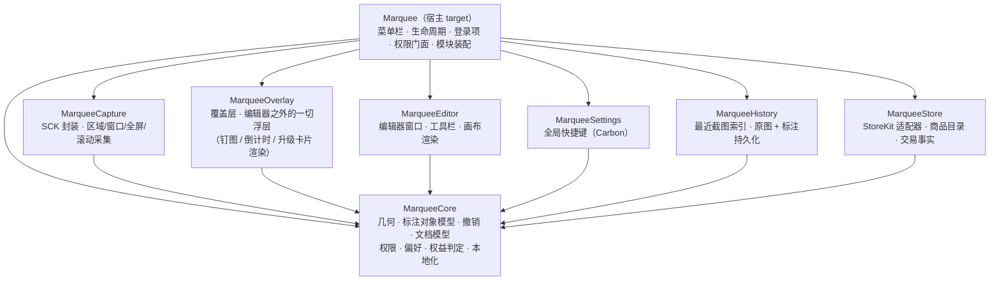
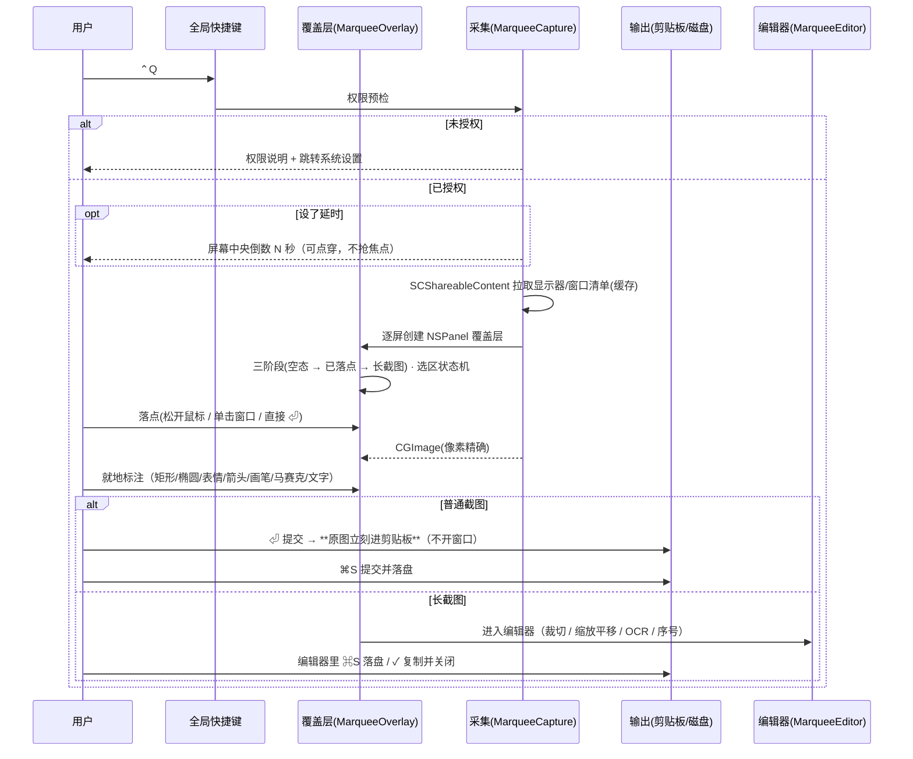
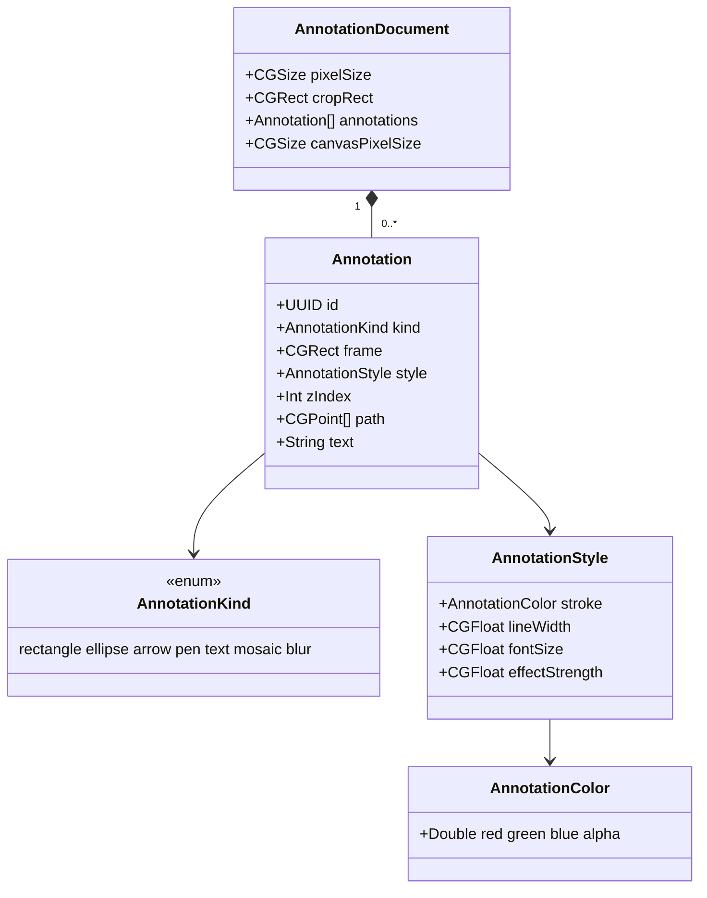
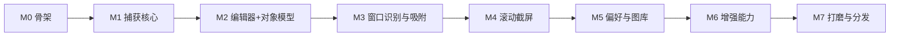

# Marquee — macOS 原生截屏工具 · 产品与方案设计

| 项 | 内容 |
| --- | --- |
| 文档版本 | v0.3（**2026-10-03 与实现对齐**） |
| 日期 | 2026-09-30 起草 / 2026-10-03 修订 |
| 状态 | **实现已基本完成**（ticket 01–34 大部分落地）· 待**人工验收**与**上架** |
| 目标平台 | macOS **15.0+**（本地开发环境：macOS 27.0 / Xcode 27.0 / Swift 6.4 / arm64） |
| 参考对象 | 腾讯 Snip（`snip.qq.com`，Mac App Store id 512505421） |
| 工作目录 | `/Users/tango/Developments/Marquee` |
| 产品名 / bundle id | **Marquee** · `com.tango.marquee`（开发版 `.dev`） |
| 关联文档 | `docs/design/PAGE-LOGIC.md`（**界面逻辑**，设计输入的权威来源）、`docs/MAS-AND-MONETIZATION.md`（**收费与上架**）、`docs/DEV-VS-PROD.md`（开发版 vs 正式版）、`docs/STATUS-AND-ACCEPTANCE.md`（进度与人工验收清单）、`docs/PITFALLS.md`（实现陷阱）、`docs/RENDER-BENCH.md`、`docs/SPIKE-PLAN.md` |

> ⚠️ **v0.3 修订说明**：本文起草于 2026-09-30（改名当天），此后实现了 34 张 ticket。
> 本次逐条对齐，**改动分三类**，都在 §0.1 里列了：
> ① 产品意图已改（分发路线、收费、引导）—— 这类是**规格变了**，不是实现走偏；
> ② 事实过时（命名、模块、模型、菜单、默认目录）；
> ③ 实现新增但原文未提（覆盖层工具条、内购、引导…）。
>
> **界面的"长什么样、有哪些项、什么状态"以 `docs/design/PAGE-LOGIC.md` 为准**，
> 本文只保留产品级内容（范围 / 原则 / 约束 / 决策 / 里程碑）。两份都写界面细节必然分叉。

---

## 0. 决策摘要（TL;DR）

| # | 结论 | 状态 |
| --- | --- | --- |
| 1 | 旧版 Snip 的问题不是"功能不够"，而是 **2012 年的 Cocoa/Intel 架构未适配现代 macOS 的权限模型与硬件**，因此做**原生重写**，不做兼容层。 | ✅ |
| 2 | 重写必须保住旧版两个真正的差异化能力：**窗口自动识别高亮** 与 **滚动截屏**，这两个是能否替代旧版的关键。 | ✅ |
| 3 | 技术栈：**ScreenCaptureKit 采集 + AppKit 覆盖层 + SwiftUI 编辑器 + Swift 6 strict concurrency**，SPM 模块化，XcodeGen 产工程。 | ✅ |
| 4 | 明确砍掉旧版的腾讯生态能力（QQ 邮箱分享 / QQ 邮箱网页插件）——依赖腾讯账号体系，无法复刻也无价值。 | ✅ |
| 5 | 最低系统版本 **macOS 15.0**；26/27 专属能力（HDR、`SCScreenshotConfiguration`、滚动缓冲）以 `if #available` 形式做增强。 | ✅ |
| 6 | 画布渲染 **用 SwiftUI Canvas**（实测最优，见 `docs/RENDER-BENCH.md`）；CG 仅用于导出与非交互路径；**首期不引入 Metal**。 | ✅ |
| 7 | 功能范围 **P0 + 精简版 P1**；滚动截屏**允许分期**——先交付可用形态（M3），自动滚动与拼接收敛至 M4。 | ✅ |
| 8 | 交互与视觉：**原生 Liquid Glass**，且必须满足"功能简洁、交互流畅"（见 3.1 的量化预算）。 | ✅ |
| 9 | 产品命名：**已定为 `Marquee`**（2026-09-30）。bundle id `com.tango.marquee`，开发版 `.dev`。 | ✅ |
| 10 | **收费**：买断 **¥36** 的非消耗型 IAP（`com.tango.marquee.pro`）+ **7 天一次性试用**（0 价非消耗型）。**Pro 只含四项现存能力**：滚动截屏 / 识别文字 / 钉图 / 最近截图不设上限（免费 5 张）。其余全部免费。 | ✅ |
| 11 | **分发**：**改为上 Mac App Store（路线 B）**，Developer ID 那条路并存作后路。代价已接受：**沙盒版砍掉自动滚动，只留手动长截图**（`CGEventPost` 不允许来自沙盒应用）。 | ✅ |
| 12 | **首次启动引导**：三步并作一页（它是什么 / 挑一个键 / 屏幕录制权限），走完或叉掉都不再出现。**这一条推翻了原「无启动引导」原则** —— 见 3 的修订。 | ✅ |

---

## 0.1 与实现的对齐（2026-10-03）

### ① 产品意图已改（规格变了，实现是对的）

| 项 | 原文（v0.2） | 现在 |
| --- | --- | --- |
| 分发形态 | 「沿用建议 Developer ID 公证（非 MAS）」§8.1 | **上 MAS**（路线 B）；沙盒只加在新增的 `MAS` 配置上，`Release` 仍是 Developer ID 那条路 |
| 收费 | 全篇未提 | 买断 ¥36 + 7 天试用；Pro 四项能力；见 `docs/MAS-AND-MONETIZATION.md` |
| 启动引导 | 原则表写「**无启动引导**」 | **有**，且是刻意的：这个 app 装完只有菜单栏一个图标，第一次用的人面对的是"什么都没发生" |
| `Esc` 的语义 | 「`Esc` = 复制并关闭」（§3、§4.1 B6） | **`⏎` = 提交；`Esc` = 取消**，而且是**退一层**（先收弹层/卡片 → 再丢输入 → 再取消工具 → 再取消选区 → 最后才取消整次截图）。一个键同时是"确认"和"取消"必然误触。⚠️ **2026-10-03 补**：这条原本只落实在覆盖层，**编辑器窗口里 `Esc` 仍是「完成并复制」** —— 同一份产品里同一个键两个性格。已统一，判据在 Core（`EscapeLadder.swift`） |
| 滚动截屏 | §8.1「M3 手动 → M4 自动」 | **两种模式都做了**；但**沙盒版只提供手动**（自动滚动要辅助功能授权，而沙盒禁止向其它 app 投递事件） |

### ② 事实过时（原文写的是当时的形状）

| 位置 | 原文 | 实际 |
| --- | --- | --- |
| 全篇 | `Snipo*` | **`Marquee*`**（模块、类型、mermaid 图都改） |
| §5.2 | 7 个 SPM 模块含 `SnipoApp` | **`MarqueeCore / Capture / Overlay / Editor / Settings / History / Store`**；宿主 target 叫 `Marquee`，**不是 SPM 模块**；`Store` 是新增的 |
| §3.1 | 菜单项列「…/延时截屏/…」 | 实际 5 项：截屏 / 滚动截屏 / 最近截图 / 设置… / 退出 —— **延时截屏已删**（同一个功能两个入口会让人以为它们不同步） |
| §3.1 / §4.1 B12 | 编辑器工具含「序号」「直线」 | 实际 9 个：选择 / 矩形 / 椭圆 / 箭头 / 画笔 / 文字 / 马赛克 / 模糊 / **裁切**。**序号已降级为文字预设**（4.2 表格写了降级，§3.1 却没同步）；**没有直线工具** |
| §4.1 B7 | 保存默认「桌面」 | **`~/Pictures/Marquee`** —— 沙盒的文件访问 entitlement 是**枚举式**的，**「桌面」不在里面** |
| §4.1 B14 | 延时 3 / 5 / 10 秒 | `[0, 3, 5, 10]`，**含「不延时」**（默认） |
| §5.7 | `SnipDocument` / `AnnotationKind{line,highlight,counter}` / `AnnotationStyle{fillColor,opacity,dash}` / `EditCommand` 协议 | 实际 **`AnnotationDocument`** / `AnnotationKind{rectangle,ellipse,arrow,pen,text,mosaic,blur}` / `AnnotationStyle{stroke,lineWidth,fontSize,effectStrength}`；撤销走会话（**没有 `EditCommand` 协议**） |
| §5.9 | `CanvasRendering { func draw(document: SnipoDocument, in size: CGSize) }` | 协议实际只有 `static var backendName`（后端标识）—— **原文那个签名没实现过** |
| §5.1 | 全局快捷键「Carbon 或 `NSEvent`（需权衡），见 6.7 风险」 | **已定 Carbon**（`CarbonGlobalHotKey`）；R4 已消除；**原文的「6.7 节」不存在**（悬空引用） |
| §5.5 第 6 条 | 「任何阶段 `Esc` 都必须干净退出」 | 见上：**四级退**，不一步退出 |
| §4.2 F8 | 最近截图「最近 N 张」 | 面板最多 **12** 条；**免费版磁盘上只留 5 张**（越界即淘汰，连文件一起删） |
| §4.2 F5 | OCR「可框选复制、全部复制」 | 实际：整块识别 + **全量复制**（没有框选复制） |
| §7 | M0–M7 里程碑 | **已被 `to-tickets` 的 ticket 01–34 取代**，见 §7 的映射 |
| §2 | 自定义快捷键「**支持多套动作绑定**」 | **只有一个绑定**（全屏截图）。多模式是覆盖层内部的形态，不是多套热键 |

### ③ 实现新增，原文未提

| 新增 | 在哪 | 说明 |
| --- | --- | --- |
| **覆盖层浮动工具条**（15 格） | §3.1 与 §4 补 | 7 绘制工具 + 样式 + 识别文字 + 撤销/重做/保存/钉图/取消/完成；**整条必须放得进 1024 点的屏** |
| **覆盖层内两个弹层** | 同上 | 「样式」＝色板 ×6 + 尺寸 ×3；「表情」＝常用 24 枚。**尺寸三档的含义随工具变**（线宽 / 打码强度 / 字号） |
| **表情贴纸** | §4.1 | 产出的仍是文字标注（内容是一个 emoji）—— 交互问题，不是模型问题 |
| **就地标注**（不开编辑器） | §4.1 | 普通截图**不出窗口**：原图立刻进剪贴板，标注就地画 |
| **内购与升级卡片** | §4 / §8 | 见 §0.1 ① |
| **首次启动引导** | §4 | 见 §0.1 ① |
| **本地化** | §4.3 A6 | **已做**（源语言中文 + 英文，222 条），不再是 P2 |
| **沙盒化（`MAS` 配置）** | §5 / §8 | `app-sandbox` + 三项 entitlement；`ENABLE_HARDENED_RUNTIME` 四配置同开（公证要求） |

### ④ 只在这一份里、不重复进本文的

界面逐项逻辑（有哪些设置、各自含义、什么状态、什么规则）—— **`docs/design/PAGE-LOGIC.md`**。

---

## 1. 背景与目标

### 1.1 旧版 Snip 的现状

旧版 Snip 是腾讯 2012 年推出的 Mac 截屏应用。其发布节奏说明了它的实际状态：

| 版本 | 发布时间 | 说明 |
| --- | --- | --- |
| v1.0 | 2012-04-18 | 首发 |
| v1.2 | 2012-05-19 | 原生架构重写、Retina 支持、QQ 邮箱分享 |
| v2.0 | 2012-11-30 | 多显示器截屏、仅复制到剪贴板、无背景窗口截取 |
| — | — | **此后近 14 年无实质功能更新** |

技术上的直接后果：

- **架构陈旧**：Cocoa / Intel-only（App Store 包体仅 2.5 MB，最后更新于 2012 年），无 arm64 原生支持。
- **未适配现代权限模型**：现代 macOS 截屏必须走 Screen Recording TCC 授权，旧版依赖 `CGWindowListCreateImage` 时代的路径，在受管设备 / 新版系统上行为不可预期。
- **未适配新硬件与新系统能力**：无 HDR、无 Stage Manager / 多 Space 正确行为、无 Apple Silicon 优化、无 Liquid Glass 设计语言。
- **生态绑定失效**：邮件分享依赖 QQ 邮箱绑定与浏览器插件，已是历史包袱。

### 1.2 目标

用现代原生技术栈复刻一个**可日常替代系统截图 + 覆盖旧版 Snip 全部有效能力**的 macOS 截屏应用，并补齐现代系统必须具备的能力。

**验收总纲（一句话）**：在不打开任何第三方账号、不联网的前提下，完成"快捷键触发 → 精准选区 / 识别窗口 → 标注 → 复制或归档"的全链路，且在多显示器、多 Space、全屏应用、外接 Retina/HDR 屏等场景下行为可预期。

### 1.3 非目标（明确不做）

| 不做 | 原因 |
| --- | --- |
| QQ 邮箱分享 / QQ 邮箱网页插件 | 依赖腾讯账号体系与浏览器插件，无法复刻且已无价值 |
| 云端账号、云相册、团队协作 | 产品定位为纯本地、无账号；也规避隐私合规成本 |
| Windows / Linux 版本 | 首期聚焦 macOS 原生体验 |
| 云端 AI 调用 | 与"纯本地"定位冲突；本地 AI 能力放到 P2 且可选 |

---

## 2. 旧版 Snip 功能基线拆解

以下为旧版官方能力清单（来源：`snip.qq.com` 官方站与产品资料），逐条给出新版处置策略。

| 旧版能力 | 旧版表现 | 新版策略 | 优先级 |
| --- | --- | --- | --- |
| 手动划选区域截屏 | 鼠标拖拽选区 | **保留**，并强化（尺寸/坐标 HUD、方向键微调、比例锁定） | P0 |
| 窗口自动识别 | 鼠标悬停窗口高亮，单击完整选定 | **保留**，核心特色，做踏实 | P1 |
| 滚动截屏（长截图） | 偏好设置开启，选定窗口单击后自动滚动拼接；**MAS 版不支持** | **保留**，现代化重做（自动 + 手动两种模式） | P1 |
| Retina 支持 | 保留高分辨率细节 | **保留**（现代系统已是基线，需保证 1x/2x 像素精确） | P0 |
| 标记：矩形 / 椭圆 / 箭头 / 文字 / 涂鸦 | 可调整位置、大小、颜色 | **保留**，升级为完整对象模型 | P0 |
| 标记可**再次编辑** | 做好标记后可再选中调整 | **保留**，这是旧版真正的手感优势，必须做到位 | P0 |
| 撤销 / 重做 | `⌘Z` / `⇧⌘Z` | **保留**，命令模式实现 | P0 |
| 全屏 / 多显示器截屏 | v2.0 起支持 | **保留** | P0 |
| 保存到磁盘（位置可配置） | 默认桌面 | **保留**，扩展格式与命名模板。⚠️ **新版默认 `~/Pictures/Marquee`** —— 沙盒的文件访问 entitlement 是枚举式的，「桌面」不在里面（见 §0.1 ②） | P0 |
| 仅复制到剪贴板 | v2.0 起支持；`⌥`+双击并存 | **保留**，做成剪贴板优先工作流 | P0 |
| 自定义快捷键 | 默认 `⌃Q`，1–3 个修饰键 + 字母/数字 | **保留**。⚠️ **只有一个绑定**（全屏截图）—— 原文的「多套动作绑定」**没做也暂无必要**：多模式是覆盖层内部的形态切换，不是多套热键 | P0 |
| QQ 邮箱分享 / 邮件分享 | 绑定账号后一键分享 | **砍掉** | — |

---

## 3. 产品定位

**一句话定位**：轻量、无账号、纯本地、键盘驱动的 macOS 原生截图工具，把"截完就能用"做到极致。

**设计原则**

| 原则 | 具体含义 |
| --- | --- |
| **功能简洁** | 不做功能清单，做功能取舍。每一项新增功能都必须回答"它是否让主链路更快"。宁可少一个工具，不要多一层菜单。 |
| **交互流畅** | 覆盖层与画布的每一次重绘都在一帧预算内。流畅是硬指标（见 3.1），不是形容词。 |
| 剪贴板优先 | 大多数截图是为了立刻粘贴。**`⏎` = 提交（原图立刻进剪贴板）**，`⌘S` = 存盘，不强迫用户做选择。⚠️ `Esc` **不是**"复制并关闭"，它是取消 —— 一个键同时是确认与取消必然误触（见 §0.1 ①）。 |
| 零打扰 | 无 Dock 图标（`LSUIElement`），菜单栏一个图标解决所有入口。**首次启动有一次一页式的引导**（走完或叉掉都不再出现），此后不再打扰 —— 这一条**推翻了原文的「无启动引导」**。 |
| 选区即所见 | 覆盖层上实时显示尺寸/坐标/放大镜/窗口高亮，落点前就知道拿到什么。 |
| 可逆 | 全链路撤销重做；`Esc` 四级退**绝不一步丢整次截图**。⚠️ **普通截图不进入编辑器**（就地标注 → 直接进剪贴板）；只有**长截图**才进编辑器 —— 少一步才是这个产品的价值。 |
| 本地闭环 | 不联网、不上传、不登录。 |

### 3.1 "简洁 + 流畅"的量化约束

**界面元素上限**（超出即视为违反原则，需在评审中论证）：

| 位置 | 上限 |
| --- | --- |
| 菜单栏下拉 | ≤ 6 项。实际 **5 项**：截屏 / 滚动截屏 / 最近截图 / 设置… / ─ / 退出 |
| **覆盖层浮动工具条** | **整条必须放得进 1024 点宽的屏**（实测 15 格 ≈ 545 点）。这条是它从"12 格 + 12 格色板"改成"15 格 + 弹层"的原因 |
| 编辑器工具栏 | ≤ 9 个工具。实际：选择、矩形、椭圆、箭头、画笔、文字、马赛克、模糊、裁切（**序号降级为文字预设，不占工具位**；**没有直线工具**） |
| 首选项页数 | ≤ 4 页（通用 / 截屏 / 输出 / 快捷键）。**后来加的 Pro 状态区接在「通用」页底部，而不是新增第 5 页** |
| 模式弹窗 | **0 个**。⚠️ 界定：覆盖层的样式/表情弹层、升级卡片都是**非模态原地浮层**，不算；权限提示是系统模态对话框，属豁免项 |
| 每个工具的可调项 | ≤ 3 个（颜色、粗细/字号/打码强度）；其余用预设。实际每处只有 **2 项**（色板 ×6 + 尺寸 ×3） |

**交互性能预算**（依据 `docs/RENDER-BENCH.md` 实测，写入 M1–M3 验收）：

| 交互 | 预算 | 实测余量 |
| --- | --- | --- |
| 覆盖层出现（快捷键 → 蒙层可见） | ≤ 1 帧（16.7 ms） | ⏳ **无实测记录**（M1 早已完成，但这一项没留下数据 —— 人工验收时应补） |
| 选区拖拽 / 窗口悬停高亮刷新 | 120 fps（8.3 ms/帧） | Canvas 绘制 ≈0.1 ms，余量 >80×（`RENDER-BENCH`） |
| 编辑器重绘（≤ 100 标注） | ≤ 4 ms | 0.20 ms（51 图元），余量 20× |
| 马赛克 / 模糊操作一次 | ≤ 5 ms | CoreImage 实测 2.64 ms |
| 落点 → 剪贴板可用 | ≤ 150 ms | ⏳ **无实测记录**（含采集开销） |

---

## 4. 功能范围

### 4.1 P0 · 基础功能（没有就不算可用）

| # | 功能 | 验收标准 |
| --- | --- | --- |
| B1 | 菜单栏常驻应用 | 无 Dock 图标；菜单栏图标提供 **截屏 / 滚动截屏 / 最近截图 / 设置… / 退出**（5 项）；`LSUIElement = true` |
| B2 | 全局快捷键触发 | 默认 `⌃Q`，设置内可改；冲突检测与提示；应用未运行时也能唤起（`SMAppService` 登录项） |
| B3 | 区域截屏 | 拖拽选区；实时显示尺寸（pt & px）与坐标；`⇧` 锁定正方形/比例；方向键 ±1px 微调、`⇧`+方向键 ±10px；`Esc` 取消 |
| B4 | 全屏截屏 | 单显示器全屏；多显示器可选目标屏或"所有屏幕拼接为一张" |
| B5 | 窗口截屏 | 单击窗口完整截取；默认带系统阴影（投影），按 `⌥` 切换为**无阴影、无背景**的纯净窗口内容 |
| B6 | 剪贴板优先工作流 | **`⏎` = 提交**（原图立刻进剪贴板；就地标注**不开窗口**）；`⌘S` = 保存到磁盘；粘贴可正确还原（PNG 数据 + 高分辨率）。⚠️ **`Esc` 在两个界面上共用同一条规则**（2026-10-03）：**`Esc` ＝ 退最里面那一层，退无可退时朝「不丢东西」的方向退；`⏎` ＝ 一步确认**。覆盖层四级退到「取消这次截图」；编辑器逐层退到「完成并复制并关闭」。**退到底方向相反是刻意的** —— 两边的"底"是反的（覆盖层"还没有东西"⇒ 取消是零损失；编辑器"已经有东西"⇒ 带走才是零损失），硬统一字面会让一边变危险。**统一的是规则，不是字面**；编辑器里「丢弃」只由 `✗` 承担（必须用手点）。判据在 Core（`EscapeLadder.swift`），两个界面共用 |
| B7 | 保存策略 | 保存位置可配，**默认 `~/Pictures/Marquee`**（⚠️ 不是桌面 —— 沙盒的文件访问 entitlement 是枚举式的，「桌面」不在里面）；格式 PNG / JPEG / HEIC；文件名模板（含日期、序号、应用名、窗口标题）；JPEG/HEIC 质量可调。⚠️ **只有按 `⌘S` 或点「保存」才写盘**（日常截图只进剪贴板，不落盘） |
| B8 | 像素精确输出 | 输出分辨率与显示器 backing scale 对齐（1x/2x），不产生插值模糊；`Capture resolution` 可选 最佳/自动 |
| B9 | 屏幕录制权限引导 | 启动即检测权限；未授权时给出明确说明 + 一键跳转"系统设置 → 隐私与安全性 → 屏幕录制"；授权后提示需重启应用生效 |
| B10 | 覆盖层跨屏正确性 | 多显示器各自出现覆盖层；跨屏拖拽选区正确；当前 Space 出现（不把用户拽到别的 Space）；全屏应用 / Stage Manager 下可用 |
| B11 | 首选项窗口 | General（启动行为）/ Capture（光标、阴影、延迟）/ Output（路径、格式、模板）/ Shortcuts 四页 |
| B12 | 标注编辑器（基础） | 画布缩放平移；选择、矩形、椭圆、箭头、画笔、文字、马赛克、模糊、**裁切**（9 个，到顶）。⚠️ **没有直线工具**；序号是文字工具的一个预设 |
| B13 | 撤销 / 重做 | `⌘Z` / `⇧⌘Z`，覆盖"标注 → 裁切 → 再标注"的交错操作，栈深可配 |
| B14 | 延时截屏 | 档位 **不延时（默认）/ 3 / 5 / 10 秒**，用于截取菜单、悬停态。⚠️ 延时的这几秒发生在**覆盖层出现之前** —— 覆盖层一旦出现就吃掉所有鼠标事件，那时再等几秒反而什么都摆不了 |
| B15 | **覆盖层浮动工具条** | 15 格、四组（7 绘制工具 │ 样式 │ 识别文字 │ 撤销/重做/保存/钉图/取消/完成）+ 两个弹层（样式：色板 ×6 + 尺寸 ×3；表情：24 枚）。**整条必须放得进 1024 点的屏**。详见 `PAGE-LOGIC.md` §A.4 |
| B16 | **就地标注（不开窗口）** | 普通截图**不进入编辑器**：提交后原图立刻进剪贴板，标注直接画在覆盖层的选区上。**只有长截图才进编辑器** |
| B17 | **首次启动引导** | 一页：它是什么 / 挑一个快捷键 / 屏幕录制权限。**不许是分页的多步流程**；走完或叉掉都不再出现；带 `-marquee` 前缀的自检运行一律豁免 |
| B18 | **内购与升级卡片** | 见 §8.1 决策 10–11 与 `docs/MAS-AND-MONETIZATION.md`。三个**入口**被挡住时原地弹非模态卡片；**配额类不弹卡片** |

### 4.2 P1 · 特色功能（差异化，决定能否真正替代旧版）

| # | 功能 | 说明 | 备注 |
| --- | --- | --- | --- |
| F1 | **窗口自动识别 + 高亮** | 鼠标悬停即高亮整个窗口边界，单击选定；`⇧` 悬停高亮子元素/子视图 | 旧版招牌能力，复刻重点 |
| F2 | **标注对象可反复编辑** | 每个标注是独立对象：可选中、移动、缩放、改色、改线宽、改字体；`⇧` 多选批量调整；双击文字改内容 | 旧版手感优势，必须复刻 |
| F3 | **滚动截屏 / 长截图** | **手动 + 自动两种模式都已实现**。⚠️ **沙盒版（MAS）只提供手动** —— 自动滚动要「辅助功能」授权，而沙盒**不允许向其它 app 投递输入事件**（Apple 文档明文）。两条路都用同一套 Vision 配准 + 亚像素重采样 | 技术风险最高，见 5.6 |
| F4 | 放大镜 + 像素十字线 | 选区时显示局部放大与像素级坐标；**取色能力并入本项**——`⌥` 悬停即在放大镜旁显示 HEX/RGB，一键复制，不单列独立工具入口 | 与 F6 共用基础设施 |
| F5 | OCR 文字识别 | 选区后一键识别文本并**全量复制**（⚠️ 原文写的「框选复制」**没做**）；基于系统 Vision，纯本地。⚠️ **首次调用约 25 秒**（模型未缓存）⇒ 启动时后台预热 | 无模型体积负担 |
| F6 | 智能吸附 | 选区边缘吸附到窗口边界、屏幕边缘；`⇧` 拖动锁定水平/垂直 | 手感关键 |
| F7 | 钉图（Pin） | 把截图钉在屏幕最上层，可缩放/半透明/鼠标穿透，做设计对照 | 单独入口，但复用编辑器渲染路径 |
| F8 | 最近截图（轻量） | 菜单栏弹一层缩略图列表，**面板最多 12 条**，支持复制（点缩略图即可）/ 重新编辑 / 删除。**不做完整图库窗口**（避免范围蔓延）。⚠️ **免费版磁盘上只留 5 张**，超出即淘汰（连文件一起删）| 保留原始图 + 标注向量（**分开存**，否则重编辑会退化成在成品上再画） |
| F9 | ~~保存后行为（一个偏好项）~~ | ❌ **未实现，且决定不做**。当前链路**无条件**写剪贴板，摆一个兑现不了的开关比少一个开关糟糕得多（`GeneralPreferences` 里刻意没有这一项） | 原「取代 F11」作废 |
| — | **表情贴纸** | 常用 24 枚；产出的**仍然是 `.text` 标注**（内容是 emoji），所以绘制/导出/缩放/移动全部复用现成路径 | 实现新增（ticket 24） |
| — | ~~序号标记~~ | 降级为**文字工具的预设**（`1.` `2.` 自增），不占独立工具位 | 满足工具栏 ≤9 的约束 |

> **相对 v0.1 的收敛**：原 F5 取色器 → 并入 F4；F8 序号标记 → 降级为文字预设；F10 完整图库 → 收敛为 F8 最近截图；F11 自动动作 → 收敛为 F9 单个偏好项。P1 从 11 项工具收敛为 **7 项能力 + 2 项轻量形态**，以符合第 9 条"功能简洁"。

### 4.3 P2 · 增强（后续迭代，非首期）

| # | 功能 | 说明 |
| --- | --- | --- |
| A1 | 屏幕录制 | 基于 `SCRecordingOutput`，含麦克风/系统音频、区域录制、录制后编辑（`SCRecordingEditor`） |
| A2 | 近期片段回溯 | 基于 macOS 27 的 `SCClipBufferingOutput`（滚动缓冲，最长 15 秒）——"刚才那段没录上"的后悔药 |
| A3 | 本地 AI 组织 | 本地视觉模型自动命名/打标/分类 + 语义搜索（需评估模型体积与 Ollama 依赖） |
| A4 | HDR 截屏 | 基于 macOS 26+ 的 HDR 截图配置，保留 XDR 屏高动态范围 |
| A5 | 导出 / 互操作 | 导出 PDF、系统"分享"扩展、Shortcuts 动作、AppleScript / URL Scheme 自动化 |
| A6 | ~~多语言~~ | ✅ **已提前完成**（源语言中文 + 英文，222 条文案）。本地化用**单一 catalog** + 生成器，`docs/` 里那条约束（key ＝中文原句）仍然有效 |

---

## 5. 技术方案

### 5.1 技术选型

| 层 | 选型 | 理由 |
| --- | --- | --- |
| 语言 / 并发 | Swift 6.x，strict concurrency，UI 层 `@MainActor`，采集层 `actor`/`Sendable` 边界 | 与新 SDK 的 `Sendable` 标注对齐，避免数据竞争 |
| 采集 | **ScreenCaptureKit**（`SCScreenshotManager` / `SCStream`） | 唯一被官方支持的现代采集路径，TCC 合规；旧版走的 `CGWindowListCreateImage` 已被弃用 |
| 覆盖层 | **AppKit**（`NSPanel` / `NSWindow`，逐屏一个） | 需要精确鼠标事件、跨 Space、无窗口动画、可屏蔽系统阴影，SwiftUI 做不了这层 |
| 编辑器 | **SwiftUI `Canvas`** 为唯一交互式画布渲染后端；Metal 首期不引入；详见 5.9 与 `docs/RENDER-BENCH.md` | 实测在真实标注量级下最快，且省掉整套自建渲染工程 |
| 滤镜（模糊/马赛克） | **CoreImage**（`CIGaussianBlur` / `CIPixellate`） | 实测全画布 2.5 ms（GPU），比手工 CG 快 6× |
| 图像 / 编码 | Core Graphics + ImageIO（`CGImageDestination`）、Vision（OCR/配准） | 全系统框架，无第三方依赖 |
| 偏好存储 | `AppStorage` / `UserDefaults` + 强类型包装 | 轻量 |
| 全局快捷键 | **Carbon `RegisterEventHotKey`**（`MarqueeSettings/CarbonGlobalHotKey`） | ✅ **已定稿**：SPIKE G1/G2 实测在**未申请辅助功能权限**下注册成功，冲突可检测（重复注册返回 `-9878`）。`NSEvent` 全局监听强依赖输入监控权限，降为备选。⚠️ 原文的「见 6.7 风险」是**悬空引用**（没有 6.7 节） |
| 偏好存储 | `UserDefaults` + 强类型包装（Core 的 `UserDefaultsPreferencesStore` / `UserDefaultsOutputStore`） | 轻量；**不用 `AppStorage`**（UI 层不持有偏好，逻辑在 Core 才可脱机单测） |
| 工程 | **XcodeGen**（`project.yml`）+ SPM 本地包模块化 | 与既有项目习惯一致，工程文件可 review |
| 工程 | **XcodeGen**（`project.yml`）+ SPM 本地包模块化 | 与既有项目习惯一致，工程文件可 review |
| 测试 | XCTest / swift-testing + 快照测试 | 沿用"红 → 实现 → 绿 + TSan 复验"门禁 |

### 5.2 模块划分

> ⚠️ **v0.3 修订**：原文画的是 `SnipoApp` 作为一个 SPM 模块 ——**它从来不是**，
> 它是宿主 target `Marquee`。SPM 模块是下面 7 个，**`MarqueeStore` 是新增的**（ticket 29–31）。
>
> **一条结构约束**：**只有 `MarqueeCore` 无依赖，其余模块只依赖 Core，模块之间互不依赖。**
> 所以"接缝 + 编排"放在 Core，实现模块只给 OS 实现 —— 编排才能脱机单测。

| 模块 | 职责 | 可测试性 |
| --- | --- | --- |
| `MarqueeCore` | **接缝 + 编排 + 全部纯逻辑**：几何、标注对象模型、命中测试、撤销、文档模型、命名模板、编码、权限探针、偏好模型、**权益判定（`LicenseResolver`）**、本地化 `L10n` | **全量单测覆盖**（测试最多的一块） |
| `MarqueeCapture` | SCK 封装：`SCShareableContent` 查询、内容过滤器构造、区域/窗口/全屏/滚动采集 | 协议抽象 + Mock 数据源 |
| `MarqueeOverlay` | 覆盖层窗口管理、选区状态机、鼠标/键盘事件、放大镜、窗口高亮、**钉图与倒计时**、升级卡片的**绘制** | 状态机可单测（几何与判据都在 Core），窗口行为靠手工验收 |
| `MarqueeEditor` | 编辑器 UI、工具栏、画布渲染、标注交互 | 渲染与交互靠 `-marqueeDemoEditor` 冒烟 + 手工 |
| `MarqueeSettings` | 全局快捷键注册与冲突检测（Carbon） | 单测 |
| `MarqueeHistory` | 最近截图索引、原图与标注持久化 | 单测 + 文件系统临时目录 |
| `MarqueeStore` | StoreKit 适配器、商品目录、交易事实（**不改判定**） | 单测 + `Products.storekit` 配置一致性测试 |
| `Marquee`（宿主） | 菜单栏、生命周期、登录项、权限引导、**依赖注入与模块装配** | 端到端手工验收清单 |

**测试目标**：`MarqueeCoreTests` · `MarqueeHistoryTests` · `MarqueeCaptureTests`（真实 Vision 自检）· `MarqueeStoreTests`（商品配置一致性）· `MarqueeTestSupport`（测试专用，不是产品模块）。

### 5.3 关键 API 证据（已对本地 SDK 核实）

> 核实环境：`/Applications/Xcode.app/.../MacOSX27.0.sdk`（macOS SDK 27.0，Xcode 27.0）。以下行号可直接跳转校验。

| 能力 | API | 可用性 | SDK 出处 |
| --- | --- | --- | --- |
| 按屏幕坐标矩形截图（跨屏） | `SCScreenshotManager.captureImage(in:)` | macOS **15.2**+ | `SCScreenshotManager.h:161` |
| 内容过滤 + 流配置截图（可控制光标/阴影/子窗口） | `captureImage(contentFilter:configuration:)` | macOS **14.0**+ | `SCScreenshotManager.h:153` |
| 截图配置对象（HDR / 多格式 / 阴影 / 目标矩形） | `SCScreenshotConfiguration` | macOS **26.0**+ | `SCScreenshotManager.h:46` |
| 输出对象（SDR / HDR 双图 + 落盘 URL） | `SCScreenshotOutput` | macOS **26.0**+ | `SCScreenshotManager.h:118` |
| 带配置的矩形截图 | `captureScreenshot(rect:configuration:)` | macOS **26.0**+ | `SCScreenshotManager.h:179` |
| 单窗口独立过滤（窗口截图核心） | `SCContentFilter(desktopIndependentWindow:)` | macOS **12.3**+ | `SCStream.h:152` |
| 显示器级过滤（可选排除本进程窗口） | `initWithDisplay:excludingWindows:` / `includingApplications:exceptingWindows:` | macOS 12.3+ | `SCStream.h:160` / `:177` |
| 排除自身进程窗口，避免截到覆盖层 | `SCStreamConfiguration.excludesCurrentProcessAudio`（音频先例）→ 视觉侧用 filter 排除 | macOS 13.0+ | `SCStream.h:330` |
| 去窗口阴影 | `SCStreamConfiguration.ignoreShadowsSingleWindow` | macOS **14.0**+ | `SCStream.h:340` |
| 含子窗口（弹窗/浮层） | `SCStreamConfiguration.includeChildWindows` | macOS **14.2**+ | `SCStream.h:375` |
| 采集分辨率策略（响应 Retina/像素精确） | `SCStreamConfiguration.captureResolution` | macOS **14.0**+ | `SCStream.h:345` |
| 缩放比例 / 内容矩形（换算 pt↔px） | `SCContentFilter.pointPixelScale` / `.contentRect` | macOS 14.0+ | `SCStream.h:120` / `:125` |
| 光标与点击可视化 | `showsCursor` / `showMouseClicks` | 12.3 / 15.0+ | `SCStream.h:274` / `:279` |
| 源/目标子矩形（局部采集与摆放） | `sourceRect` / `destinationRect` | macOS 12.3+ | `SCStream.h:289` / `:294` |
| 窗口枚举与元数据（识别高亮的基础） | `SCShareableContent` → `SCWindow{windowID, frame, title, windowLayer, owningApplication, isOnScreen, isActive}` | macOS 12.3+（`isActive` 13.1+） | `SCShareableContent.h` |
| 滚动缓冲（近期片段回溯） | `SCClipBufferingOutput`（最长 15s，可导出 clip） | macOS **27.0**+ | `SCClipBufferingOutput.h` |
| 屏幕录制 | `SCRecordingOutput` / `SCRecordingEditor` | 15.0+ / 26.0+ | `SCRecordingOutput.h` / `SCRecordingEditor.h` |
| 系统内容选择器 | `SCContentSharingPicker` | macOS 14.0+ | `SCContentSharingPicker.h` |
| HDR 采集预设 | `SCStreamConfigurationPreset`（4 种 HDR 预设） | macOS 15.0+ | `SCStream.h:219` |
| OCR | Vision（`RecognizeTextRequest` / `ImageRequestHandler`） | 系统框架 | 实现时核实具体符号 |

**已由 `docs/SPIKE-PLAN.md` 验证或转入验证清单的项**

| 项 | 状态 |
| --- | --- |
| 屏幕录制权限检测 API | ✅ **已确证**：`CGPreflightScreenCaptureAccess()` / `CGPreflightListenEventAccess()` 位于 `CoreGraphics`（符号在 `CoreGraphics.tbd`，头文件位置与常见文档不一致），编译链接通过 |
| 无权限下的窗口几何获取 | ⏳ 待人工（SPIKE M7）：`SCShareableContent` 需要屏幕录制授权，未授权行为需实测 |
| `SCStreamConfiguration.preset` 的具体用法 | ⏳ 待人工：API 存在已确认，参数组合需实测 |
| Liquid Glass 可用性 | ✅ **已确证**：`NSGlassEffectView` / `NSGlassEffectContainerView` 为 `macos(26.0)+`，`effectIsInteractive` 为 `macos(27.0)+`；`SCScreenshotConfiguration` 为 `macos(26.0)+`。最低系统 15.0 下**必须**包 `if #available` 并提供降级 |

### 5.4 核心流程

> ⚠️ **v0.3 修订**：原文画成"采集完就进编辑器"，且写着 `Esc=复制`。
> 实际是**两条路**：普通截图**不开窗口**（少一步才是这产品的价值），
> 只有**长截图**才进编辑器；`Esc` 是**取消**，不是复制。

### 5.5 覆盖层实现要点（这类应用的技术核心）

1. **逐屏一个 `NSPanel`**：`level` 取到 `.screenSaver` 之上或足够高的 `.statusBar + N`；`collectionBehavior` 需包含 `.canJoinAllSpaces`、`.fullScreenAuxiliary`、`.stationary`；`backgroundColor = .clear`、`isOpaque = false`、`hasShadow = false`。
2. **不要**把整屏截图铺到覆盖层上再让用户在其上画框（这是很多实现的坏味道）：会引入色彩偏移、HDR 色调映射错误和"截屏套娃"。做法是覆盖层只做**变暗蒙层 + 选区镂空 + 高亮描边**。
3. **排除自身**：采集时用自己的窗口（覆盖层 + 编辑器 + 菜单栏）构造排除列表，或用 `excludingWindows:` 语义，确保输出不含蒙层。
4. **窗口高亮的数据源**：`SCShareableContent` 返回 `SCWindow.frame/windowLayer/owningApplication`，用于在覆盖层绘制高亮框；需过滤系统窗口、菜单栏层、低于阈值的层，并按窗口层级排序做命中测试。
5. **首帧延迟**：覆盖层出现与采集之间的交互必须手感跟手——覆盖层先出、清单并行拉取、选区完成时才真正采集。
6. **`Esc` 是退一层，绝不一步退出**：先收弹层/升级卡片 → 再丢正在输入的文字 → 再取消工具 → 再取消选区 → 最后才取消整次截图（关覆盖层、释放资源、不残留 Space）。⚠️ 原文写的是"任何阶段都必须干净退出" —— 那会**一步把整次截图丢掉**，是错的。
   **编辑器窗口用同一套**（退到「关闭窗口」为止），判据在 Core 的 `EscapeLadder.swift`：**`Esc` 只退、`⏎` 才确认** —— 一个键不该在两个界面上有两个性格。

### 5.6 滚动截屏方案（最高技术风险项）

| 方案 | 做法 | 评价 |
| --- | --- | --- |
| **A · 自动滚动** | 用户选定区域 → 程序持续发送滚轮/翻页事件 → 连续抓帧 → 重叠区配准 → 拼接 → 裁缝 | 体验最好，是"长截图"的正确形态。✅ **已实现**。⚠️ **但沙盒版不可用** —— 需要「辅助功能」授权，而沙盒**不允许向其它 app 投递输入事件**（Apple 文档明文）。所以 MAS 版只走 B |
| **B · 手动滚动** | 用户自己滚，程序按固定节奏抓帧并拼接 | ✅ **已实现**，是**唯一两条分发路线都可用**的形态（也是 MAS 版的唯一形态） |
| C · 滚动缓冲合成 | 基于 `SCClipBufferingOutput`（macOS 27）导出片段后按时间轴取帧合成 | 依赖最新系统，覆盖人群窄，作为 A/B 的补充而非主路径 |

> ⚠️ **v0.3 修订**：原文把 A 标为"推荐"、B 标为"兜底"。
> 现在反过来：**B 是两条路线都保得住的那条**，A 只在 Developer ID 版可用。
> 用户在沙盒版按 `空格` 时，提示必须说"这个版本不提供自动滚动"，
> **句子里绝不许出现「辅助功能」** —— 出现了就是把用户支去干一件注定没用的事。

**拼接算法**：优先 Vision 的平移图像配准（`VNTranslationalImageRegistrationRequest`）或自实现归一化互相关 + 相位相关；竖直方向做行向量匹配定位重叠高度，拼接处做接缝羽化。

**已知难点（需专项验证）**：Liquid Glass 半透明标题栏与吸顶元素（sticky header）会破坏配准；滚动到底检测；滚动惯性未停止即抓帧导致运动模糊；页面含动态内容（视频、光标、加载动画）会产生鬼影。

**已完成的可行性验证（详见 `docs/SPIKE-PLAN.md` D 组，12/12 通过）**

| 验证项 | 结果 |
| --- | --- |
| 端到端拼接 vs 真值（合成长页 1200×9000，步长 600，重叠 200） | **平均绝对误差 0.000/255**，拼接高度与真值一致 |
| 亚像素滚动（步长 600.5） | 整数对齐误差 0.5 px → 抛物线精化后 **0.04 px** |
| 吸顶条 + 屏幕光标干扰 | 抗干扰通过；额外排除顶部 70 px 有效 |
| 滚动到底检测 | 位移 0 可稳定识别（代价 0.000），据此停止 |
| Vision `VNTranslationalImageRegistrationRequest` | **tx=-0.00, ty=600.00，精确无误差** |
| 自研 SAD 单次配准耗时 | **258 ms —— 太慢，不可作为主方案** |

**据此确定的实现要求**

1. **配准优先用 Vision**，自研 SAD 仅作对照/兜底；需补测 Vision 单次耗时，若同样偏慢则先在 1/4 分辨率上求整数位移再精化。
2. **必须处理亚像素**：得到小数位移后按**累计小数位移重新采样**，不可简单向下取整。
3. **必须内置"装置自检"回归**：用已知位移的合成图验证配准链路（本次正是靠它才发现三个静默错误：位图行序镜像导致位移符号反转、负坐标 rect 取帧不可靠、拼接取行区间写反）。这类 bug 不崩溃、不报错，只悄悄出错图。

### 5.7 数据模型

> ⚠️ **v0.3 修订**：原文的 `SnipDocument` **不存在**，实际叫 **`AnnotationDocument`**；
> `AnnotationKind` 里**没有 `line` / `highlight` / `counter`**（实际 7 个：
> `rectangle / ellipse / arrow / pen / text / mosaic / blur`）；
> `AnnotationStyle` **不是** `strokeColor/strokeWidth/fillColor/opacity/font/dash`，
> 而是 **`stroke / lineWidth / fontSize / effectStrength`** 四项
>（`fontSize` 与 `effectStrength` 各自服务文字与打码，没有通用透明度与虚线）。

- **撤销**：命令模式，但类型叫 **`EditorCommand`**（在 `AnnotationEditorSession` 内部，栈是私有的），**不是原文写的 `EditCommand` 协议**。覆盖"新增 / 修改 / 删除标注 / 裁切"，保证"标注 → 裁切 → 再标注"的交错撤销语义正确。**拖框期间不进撤销栈**（一次拖动只留一个可撤销步骤）。
- **持久化**：历史保存 `原图` + `annotations` 向量，**两者分开存**（否则重编辑会退化成在成品图上再画）。导出时才栅格化。
- **坐标约定**：标注坐标存**选区局部点**（原点＝视觉左上角、y 向下），只在栅格化那一刻换算；**线宽/字号/打码强度跟位置一起缩放**。
- **两种导出**：栅格化（PNG/JPEG/HEIC 落盘或剪贴板）与向量（内部文档 / 未来 PDF 导出）。

### 5.8 测试与质量门禁

沿用既有纪律：**先复现（红）→ 实现 → 转绿 → 测试永久留仓**。⚠️ v0.3 修订：实际还多了一条**变异测试**（改坏一行，看有没有测试变红），它比 TSan 更常救场。

| 层 | 手段 | 覆盖对象 | 现状 |
| --- | --- | --- | --- |
| 单元测试 | swift-testing | 几何与吸附、命中测试、撤销、命名模板、编码 round-trip、快捷键冲突、**权益判定**、**本地化 key 校验**、**卡片几何** | ✅ 五个测试目标（Core 最多） |
| 集成测试 | 协议注入 Mock 采集源 | 采集 → 文档 → 导出全链路，不依赖真实屏幕 | ✅ |
| **装置自检** | 用**已知位移的合成图**验证配准链路 | 滚动截屏的配准与拼接 —— 这类 bug 不崩不报错，只悄悄出错图 | ✅（`MarqueeCaptureTests`，真实 Vision） |
| **变异测试** | 改坏新判据，看对应测试是否变红 | 每张 ticket 的新增判据 | ✅ 逐 ticket 做 |
| 快照测试 | 渲染比对 | 编辑器画布在固定标注集下的渲染结果 | ❌ **没做**（原文列了，实际没有）；由 `-marqueeDemoEditor` 冒烟 + 手工验收顶替 |
| 并发验证 | Thread Sanitizer | 采集回调与 UI 状态交接 | 🟡 未常态化（`swift test` 有 `Sendable` 检查兜底） |
| 手工验收清单 | 逐项勾选 | 多显示器、跨 Space、全屏应用、Stage Manager、外接 HDR/Retina、权限被撤销后行为、菜单/悬停态延时截屏 | ⏳ **约 300 条已写好、待执行**（`docs/STATUS-AND-ACCEPTANCE.md` §3） |

### 5.9 渲染技术决策（实测依据）

对 SwiftUI Canvas / Core Graphics / Metal 做了本机实测（Apple M2，画布 3200 × 2000 px），完整方法与数据见 **`docs/RENDER-BENCH.md`**。核心结果（ms/帧，p50）：

| 图元数 | CG 朴素 | CG 优化 | **SwiftUI Canvas** | Metal |
| ---: | ---: | ---: | ---: | ---: |
| 51（≈真实重度标注） | 7.46 | 5.41 | **0.08** | 0.35 |
| 501 | 46.98 | 91.12 | **0.54** | 1.10 |
| 2400 | 252.70 | 185.37 | **1.48** | 3.54 |
| 24000 | 1061.55 | — | 19.64 | **7.37** |

**结论：Canvas 为主渲染，CG 只走非交互路径，Metal 首期不引入。**

三条依据：

1. **真实负载下 Canvas 最快，Metal 反而更慢**（51 图元：0.08 ms vs 0.35 ms）。Metal 每帧有固定的命令缓冲提交与同步开销，图元少时 GPU 无活可干。用户手工标注的量级是"几十个对象"，不是上万。
2. **性能不是本项目的约束。** Canvas 在 2400 图元时 1.48 ms，相对 16.7 ms 帧预算有 10× 余量；真实量级下余量超过 100×。用不到的上限不值得用"自建字形图集 + 文本编辑 + 命中测试 + 可访问性"来换——直接违背 3.1 的"功能简洁"。
3. **CG 必须留但只用在非交互路径**（导出 PNG/JPEG、剪贴板数据、马赛克降采样）：它慢在一帧只跑一次，无所谓。**但绝不能用 `CGBitmapContext` 做交互式重绘。**

**保留升级路径**：`MarqueeEditor` 的渲染入口收敛为协议 `CanvasRendering`（`Modules/Sources/MarqueeEditor/CanvasRendering.swift`），后端以 `static var backendName` 自我标识，供性能日志与基准对照。若未来出现需逐像素实时效果的场景（液化、自由形变、视频帧实时滤镜），新增 `MetalCanvasRenderer` 实现即可，不动上层。

> ⚠️ **v0.3 修订**：原文把签名写成 `CanvasRendering { func draw(document: SnipoDocument, in size: CGSize) }` ——
> **那个签名没实现过**，协议里只有 `backendName`。协议现在的作用是"后端标识 + 升级占位"，
> 画布渲染由 `MarqueeEditor` 内部的 `Canvas` 实现。
> **触发重新评估的三个条件**已写入 `RENDER-BENCH.md` 第 5 节。

---

## 6. 风险与对策

| # | 风险 | 等级 | 对策 |
| --- | --- | --- | --- |
| R1 | 滚动截屏配准失败（sticky header、动态内容、滚动惯性未停） | **中**（可行性与端到端拼接已验证） | 用 Vision 配准；**内置合成图装置自检回归**；亚像素按累计小数位移重采样；配准失败时明确降级提示而非产出错图。⚠️ 剩余风险**全在真实场景**（浏览器长页 / 聊天记录 / sticky header / 惯性 / 动态内容），只能靠人工验收 |
| R2 | 屏幕录制权限被撤销 / 首次授权需重启 | 中 | 每次触发前用 `CGPreflightScreenCaptureAccess()` 预检；权限缺失时给出可操作指引；**权限错误走独立分支，不在该路径上恢复主窗口** |
| R3 | 覆盖层在跨 Space / 全屏应用 / Stage Manager 下行为异常 | 中 | 覆盖层窗口属性集中管理；SPIKE-PLAN B 组 6 项列入手工回归清单，M0 做最小验证 demo |
| R4 | ~~全局快捷键方案选型~~ | **已消除**（SPIKE G1/G2） | Carbon `RegisterEventHotKey` 在**未申请辅助功能权限**下注册成功；冲突可检测（重复注册返回 `-9878`）。`NSEvent` 全局监听强依赖输入监控权限，降为备选。仅剩"实际触发回调"待人工确认（SPIKE M20） |
| R10 | OCR 首次调用成本极高 | 中 | 实测首次约 **25 秒**（模型未缓存），缓存后稳态 60 ms → **应用启动时后台预热**（对 1×1 空图跑一次请求），否则用户首次点击会误以为死机 |
| R11 | 超长图（如 1200×9000）在 Canvas 上的渲染开销 | 中 | 图元数量已不是瓶颈（RENDER-BENCH），但**画布尺寸**可能是。M2 需实测缩放/平移帧率，必要时改为按可视区域分块光栅化 |
| R5 | 输出色彩偏移 / HDR 屏偏色 / 像素不对齐 | 中 | 保持"覆盖层不铺截图"的做法；`captureResolution` + `pointPixelScale` 换算统一走一个工具类并单测 |
| R6 | 多显示器混合 scale（1x + 2x）导致跨屏选区尺寸错乱 | 中 | 选区几何统一用全局点坐标 + 每屏独立换算，单测覆盖混合 DPI 场景 |
| R7 | 标注对象模型做浅了（不可再次编辑），失去对旧版的核心优势 | **高** | 对象模型先行，标注一律以对象存储、导出时才栅格化；编辑器交互围绕对象设计 |
| R8 | 范围蔓延：录制、AI、云同步都想塞进首期 | 中 | 严格按 P0/P1/P2 门禁推进，每期结束做一次范围复盘 |
| R9 | 分发形态受沙盒限制 | **已落地为决策，不再是风险** | ⚠️ 沙盒版**砍掉自动滚动**（只留手动长截图），并因此**没有桌面 entitlement** ⇒ 默认落盘改 `~/Pictures/Marquee`。这条**不是"待评估"**，是已经接受的代价 —— 见决策 11 与 `docs/MAS-AND-MONETIZATION.md` |
| R12 | **沙盒版读不到容器外的旧数据** ⇒ 升级后"历史全没了" | 中 | 已查明：**迁移在沙盒内做不到**（读不到容器外的 Application Support）。路线 B 下 MAS 版是首发、本来就没有老数据；若 Developer ID 版先发过再迁 MAS，只能由那个**非沙盒**构建代劳。见 `docs/PITFALLS.md` 143/144 |

---

## 7. 里程碑与验收

> ⚠️ **v0.3 修订：里程碑已不再是推进单位。**
>
> 实际的推进单位是 **ticket 01–34**（`.scratch/issues/2026-09-30-marquee-mvp/`，含 `INDEX.md`）。
> 下方里程碑保留为**范围分组**，状态按实现现状标注；**精确的 ticket 对应看 `INDEX.md`**。

| 里程碑 | 内容 | 状态 |
| --- | --- | --- |
| **M0 骨架** | XcodeGen 工程、菜单栏宿主、`LSUIElement`、登录项、权限预检与引导、SPM 模块骨架、覆盖层最小验证 | ✅ 已落地 |
| **M1 捕获核心** | 区域 / 全屏 / 多显示器 / 窗口采集、剪贴板优先、保存策略、延时截屏 | ✅ 已落地 |
| **M2 编辑器 + 对象模型** | 文档模型、标注对象、命中测试、撤销、工具栏、画布缩放平移 | ✅ 已落地（**就地标注**额外做了 —— 普通截图不开窗口） |
| **M3 窗口识别与吸附** | 悬停高亮、单击选窗、边缘吸附、放大镜（含 `⌥` 取色）、**滚动截屏 MVP** | ✅ 已落地（含合成图装置自检回归） |
| **M4 滚动截屏（完整版）** | 自动滚动、配准优化、sticky header / 动态内容处理、失败降级 | ✅ 已落地；⚠️ 沙盒版只留手动 |
| **M5 偏好与图库** | 四页首选项、快捷键配置与冲突检测、最近截图、重新编辑 | ✅ 已落地 |
| **M6 增强能力** | OCR、取色器、序号（**已降级为文字预设**）、钉图、自动动作（**决定不做，见 4.2 F9**） | ✅ 除"自动动作"外已落地 |
| **M7 打磨与分发** | Liquid Glass 视觉、多语言、签名与公证、更新机制、**内购与上架** | 🟡 **本地化已做**、硬运行时已开；**视觉稿待出**、`package.sh` 从未真跑、沙盒化进行中、MAS 打包提审未开工 |

**每期节奏**：spec → solution → test plan → impl → delivery，逐段确认。每期结束跑一次全量回归 + 手工验收清单，测试永久留仓。

---

## 8. 决策记录

### 8.1 已确认决策（2026-09-30）

| # | 决策点 | 结论 | 影响面 |
| --- | --- | --- | --- |
| 1 | 最低系统版本 | **macOS 15.0** | `Package.swift` 的 `platforms`；26/27 专属能力走 `if #available` |
| 2 | 滚动截屏 | **要做**，且**允许分期**：先出手动滚动 MVP → 再补自动滚动与配准优化 | ✅ **两期都已完成**；⚠️ 但**沙盒版只保留手动**，见 5.6 |
| 3 | 产品名 | **`Marquee`**（2026-09-30 定）。bundle id `com.tango.marquee`，开发版 `.dev` | ✅ 目录、模块、bundle id、TCC 授权均已就位 |
| 4 | 滚动截屏排期 | 手动先行、自动后补 | ✅ 已完成，不再是排期问题 |
| 5 | 功能范围 | **P0 + 精简版 P1**（P1 由 11 项收敛为 7 项能力 + 2 项轻量形态，见 4.2） | 范围门禁 |
| 6 | 视觉风格 | **原生 Liquid Glass**，26+ 用 `NSGlassEffectView`、15 用 `NSVisualEffectView(.hudWindow)` 降级（决策点收在 Core 的 `ChromeMaterial.resolved(glassAvailable:)`，可脱机单测） | 🟡 已实现；**视觉稿待 open-design 出**（见 `docs/design/PAGE-LOGIC.md`） |
| 7 | 编辑器渲染技术 | **SwiftUI Canvas**（实测依据见 5.9 与 `docs/RENDER-BENCH.md`）；CG 走非交互路径；Metal 首期不引入 | 模块边界与性能预算 |
| 8 | 本地 AI | **只做系统级**（Vision OCR），不引入本地视觉模型 | P2 的 A3 暂缓 |
| 9 | 交互与功能基调 | **功能简洁、交互流畅**（量化约束见 3.1） | 全流程范围裁剪依据 |
| **10** | **收费** | **买断 ¥36** 的非消耗型 IAP（`com.tango.marquee.pro`）+ **7 天一次性试用**（0 价非消耗型）。**Pro 只含四项现存能力**：滚动截屏 / 识别文字 / 钉图 / 最近截图不设上限（免费 5 张）。其余全部免费 | ✅ 见 `docs/MAS-AND-MONETIZATION.md` |
| **11** | **分发形态** | ⚠️ **推翻原决策：改上 Mac App Store（路线 B）**，Developer ID 那条路并存作后路。代价已接受：**沙盒版砍掉自动滚动**（`CGEventPost` 不允许来自沙盒应用，Apple 文档明文） | ✅ 新增 `MAS` 配置（只有它带沙盒）；`Release` 仍走 Developer ID |
| **12** | **首次启动引导** | **做**，一页（它是什么 / 挑一个键 / 屏幕录制权限），走完或叉掉都不再出现 | ✅ 推翻了原「无启动引导」原则 |

### 8.2 产品命名（**已定**）

✅ **定为 `Marquee`**（2026-09-30）。bundle id `com.tango.marquee`，开发版 `com.tango.marquee.dev`。

> ⚠️ **改名有时间窗**：App Store Connect 上**传过构建之后就不能再改**。本项目没上传过，
> 所以现在仍可改，但要改就趁早。见 `docs/DEV-VS-PROD.md`。

当时的候选（留档，不再需要决策）：

| 候选 | 语义 | 未选原因 |
| --- | --- | --- |
| **Marquee** ✅ | 选框 / "蚂蚁线"，截图选区的专业本名 | —— （已选） |
| Still（定格） | 定格画面 / 剧照 | 词义过于通用，检索困难 |
| Pinpoint | 精准 + 钉图（pin）双关 | 3 音节偏长 |
| Snipo | 延续 `snip` 词根 | 无特别记忆点 |

### 8.3 从 spec 到实现（原「下一步」）

> ⚠️ 这一节原文写的是"定名后进入 solution 阶段"——**那一步早已走完**。
> 此处改为记录实现路径，以免后来的人以为还没开工。

1. ✅ 定名 `Marquee` → `project.yml`（XcodeGen）+ `Package.swift`（7 个 SPM 模块）+ 7 个测试目标
2. ✅ 测试计划落地为**五个测试目标**（Core / History / Capture / Store / TestSupport）
3. ✅ **ticket 01–34** 逐张交付（见 `.scratch/issues/2026-09-30-marquee-mvp/INDEX.md`），
   门禁：spec → solution → test plan → impl → delivery，逐段确认；TDD 红→绿 + **变异测试**；测试永久留仓
4. ⏳ **剩下的是人工验收与上架**，不是功能开发：
   - `docs/STATUS-AND-ACCEPTANCE.md` §3 的约 300 条验收（A–Z 组）**尚未执行**
   - ticket `32`（沙盒化）代码已落、待沙盒构建下重跑；ticket `33`（MAS 打包提审）未开工
   - `ENABLE_HARDENED_RUNTIME` 已全线打开（公证要求）

---

## 附录 A · 旧版 Snip 事实来源

> 这一节描述的是**被复刻的那个旧应用**（腾讯 Snip），不是本项目的现状。
> 保留它是因为"哪些能力来自旧版、哪些是新加的"这一问题只能在这里回答。

| 项 | 值 |
| --- | --- |
| 官方站点 | `snip.qq.com` |
| Mac App Store | id `512505421`（开发者：Tencent Technology (Shenzhen) Company Limited） |
| 版本历史 | v1.0 2012-04-18 / v1.2 2012-05-19 / v2.0 2012-11-30（此后无实质更新） |
| 架构 | Cocoa / Intel，包体约 2.5–4 MB |
| 沙盒权限（App Store 版） | `app-sandbox`、`assets.pictures.read-write`、`files.downloads.read-write`、`files.user-selected.read-write`、`network.client`、`network.server` |
| 已知限制 | 滚动截屏在 App Store 版本不可用 |

## 附录 B · 本次核实的环境与命令

| 项 | 值 |
| --- | --- |
| OS | macOS 27.0（build 26A428） |
| Xcode / Swift | Xcode 27.0（27A266a）/ Swift 6.4 |
| SDK | `MacOSX27.0.sdk`（`xcrun --sdk macosx --show-sdk-version` → 27.0） |
| 关键框架 | `ScreenCaptureKit.framework`（含 `SCScreenshotManager` / `SCClipBufferingOutput` / `SCRecordingOutput` / `SCContentSharingPicker`） |
| 渲染基准机器 | Apple M2（8 核），详见 `docs/RENDER-BENCH.md` |

## 附录 C · 关联文档

| 文档 | 内容 |
| --- | --- |
| `docs/PRD.md` | 本文档：产品定位、功能范围、技术方案、里程碑、决策记录 |
| **`docs/design/PAGE-LOGIC.md`** | **界面逻辑**（有哪些页、每页有什么、各自什么含义、什么状态、什么规则）—— **设计输入以它为准**，本文不重复 |
| **`docs/MAS-AND-MONETIZATION.md`** | **收费与上架**：买断 ¥36 / 路线 B / Pro 边界 / 「被挡住时」的界面行为 / 施工图 |
| **`docs/DEV-VS-PROD.md`** | **开发版与正式版怎么区分**：两个 bundle id、四个构建配置、改名时间窗 |
| **`docs/STATUS-AND-ACCEPTANCE.md`** | **进度 / 阻塞项 / 人工验收清单**（约 300 条，A–Z 组）——**验收与汇报从这里起** |
| **`docs/PITFALLS.md`** | **实现陷阱清单**（140+ 条，多为"不崩溃、不报错、只悄悄错"）——**动代码前先扫** |
| `docs/RENDER-BENCH.md` | 渲染技术实测报告：Canvas / Core Graphics / Metal 的本机基准、方法与决策依据 |
| `docs/SPIKE-PLAN.md` | 坑点/难点清单与提前验证报告 |
| `docs/RELEASE.md` / `docs/DEV-NOTES.md` | 打包公证的复现步骤 / 开发循环的已知摩擦 |
| `.scratch/issues/2026-09-30-marquee-mvp/` | **ticket 01–34 + `INDEX.md`** —— 实际的推进单位 |
| `Tools/RenderBench/` | 渲染基准源码，与产品代码分离 |
| `Tools/Spikes/` | 验证工具源码（基础探测 / `scroll` / `dump`） |
| `Tools/IconGen/` · `Tools/L10nCatalog/` · `Tools/SymbolProbe/` | App 图标生成器 · 文案目录生成器 · SF Symbol 探针 |
| `scripts/` | `build.sh` / `test.sh` / `package.sh`。**构建与测试一律走脚本**，必需参数已封装（见 `docs/DEV-NOTES.md`） |

---

**当前状态**：功能开发已基本完成（ticket 01–34），**剩下的是人工验收与上架**，不是写代码。
两处入口：

- **要验收** → `docs/STATUS-AND-ACCEPTANCE.md` §3（约 300 条，A–Z 组）
- **要开工** → ticket `32`（沙盒化收口）→ `33`（MAS 打包提审）

> 本文（v0.3）与实现对齐于 2026-10-03。**改动产品意图时请同时改 §0.1 的对齐表** ——
> 那张表的作用就是让下一个人不必再靠读代码去反推"当初说好的到底是什么"。
